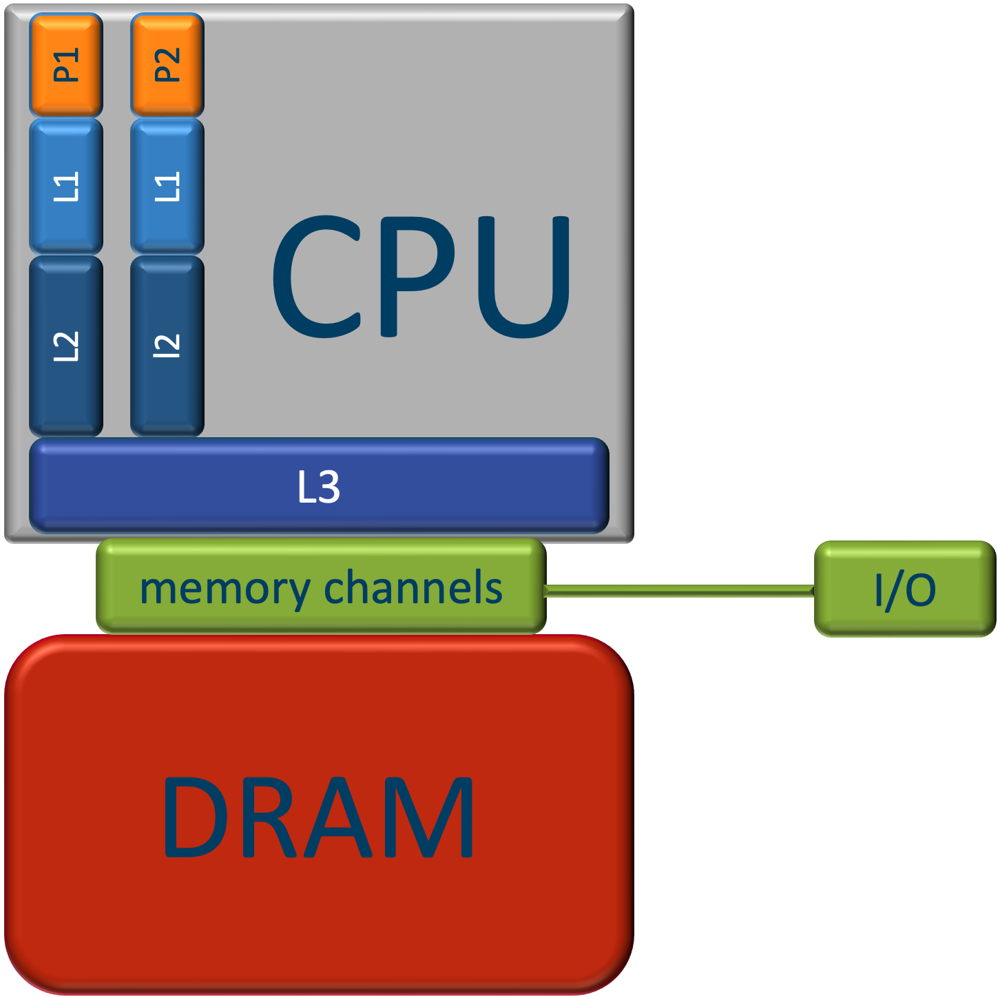
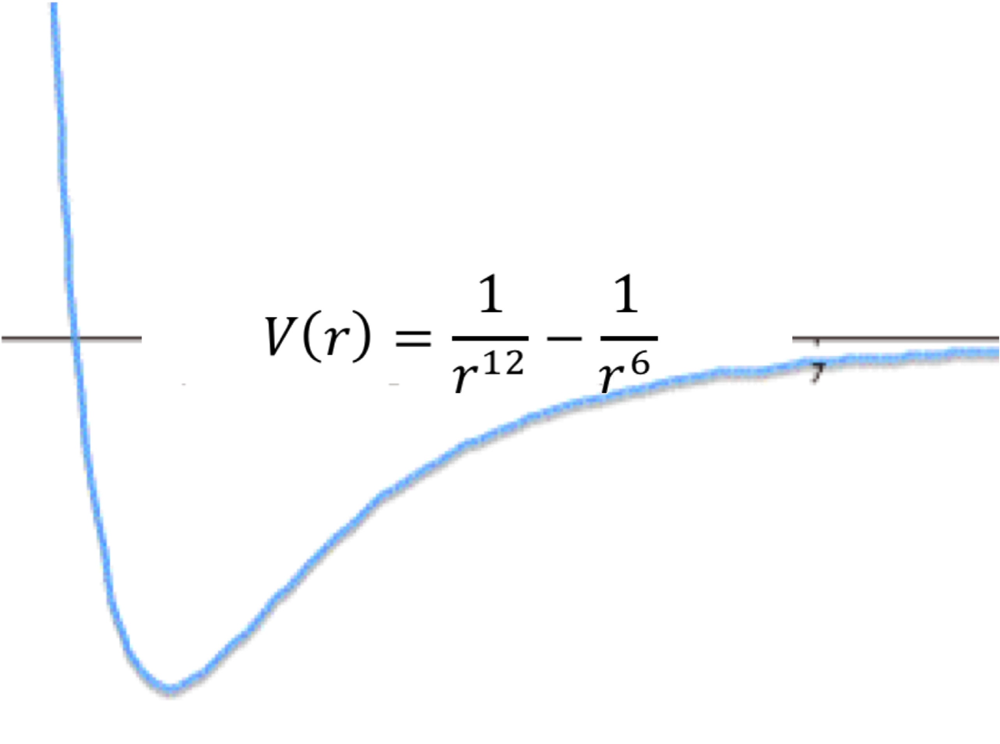
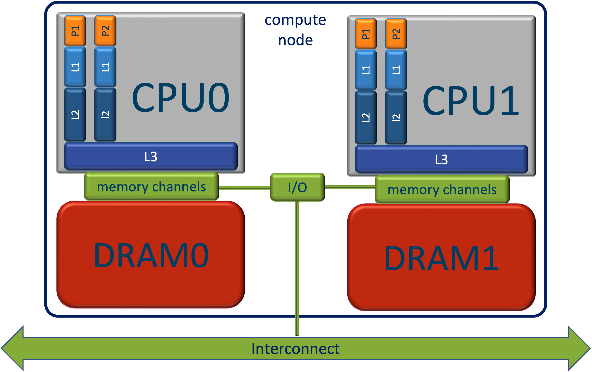

# Chapter 2 - Aspects of modern CPU architecture

You do not have to be a CPU architecture specialist in order to be able to write efficient code. However, there are 
a few aspects of CPU architecture that you should understand.

## The hierarchical structure of CPU Memory

CPU memory of modern CPUs is hierarchically organised. The memory levels close to the processor need to be fast, to 
serve it with data so that it can continue its work. As fast memory is expensive, the levels close to the processor 
are also smaller. The farther away from the processor the bigger they are, but also the slower.    

- Each processing unit (or core) has a number of **registers** (~1 kB) and vector registers on which instructions can 
  immediately operate (latency = 0 cycles). The registers are connected to  
- a dedicated **L1 cache** (~32 kB per core), with a latency of ~ 1 cycle. This is in turn 
  connected to:  
- a dedicated **L2 cache**, (~256 kB per core), with a latency of ~10 cycles. This is in turn connected to: 
- the **L3 cache**, which is shared among a group of cores, (~2 MB per core), with a latency of ~50 cycles. 
  This is connected to:
- the **main memory**, which is shared by all cores,(256 GB - 2 TB), with a latency of ~200 cycles.

The cores and the caches are on the same chip. For this reason they are considerably faster than the main memory. 
Faster memory is more expensive and therefor smaller. The figure below illustrates the layout.



The I/O hub connects the cpu to the outside world, hard disk, network, ...

When an instruction needs a data item in a register, the CPU 
looks first in the L1 cache, if it is there it will it to the register that was requested. Otherwise, the CPU looks 
in L2. If it is there, it is copied to L1 and the register. Otherwise, the CPU looks in L3. If it is there, it is 
copied to L2, L1 and the register. Otherwise, the CPU looks copies the **cache line** surrounding the data item to 
L3, L2, L1 and the data item itself to the register. A cache line is typically 64 bytes long and thus can contain 4 
double precision floating point numbers or 8 single precision numbers. The main consequence of this strategy is that 
if the data item is part of an array, the next elements of that array will also be copied to L1 so that when 
processing the array the latency associated with main memory is amortized over 4 or 8 iterations. In addition, the 
CPU will notice when it is processing an array and prefetch the next cache line of the array in order to avoid that 
the processor has to wait for the data again. This strategy for loading data leads to two important best practices for 
making optimal use of the cache.

1. Exploit **Spatial locality**: Organize your data layout in main memory in a way that data in a cache line are mostly 
   needed together. 
2. Exploit **Temporal locality**: Organize your computations in a way that once a cache line is in L1 cache, as much as 
   possible computations on that data are carried out. This favors a high computational intensity (see below). 
   Common techniques for this are **loop fusion** and **tiling**. 

### Loop fusion

Here are two loops over an array `x`:

```python
for xi in x:
    do_something_with(xi)
for xi in x:
    do_something_else_with(xi)
```
If the array `x` is big, too big to fit in the cache, the above code would start loading `x` elements into the cache,
cach line by cache line. Since `x` is to large to fit in the cache, at some point, when the cache is full, the CPU 
will start to evict the cache lines that were loaded long time a go ane are no more used to replace them with new 
cache lines. By the time the first loop finishes, the entire beginning of the `x` array has been evicted and the 
scond loop can start to transfer `x` again from the main memory to the registers, cache line by cache lina. this 
violiate the temporal locality principle. So, it incurs twice the data traffic. Loop fusion fuses the two loops into 
one and does all computations needed on `xi` when it is in the cache. 

```python
for xi in x:
    do_something_with(xi)
    do_something_else_with(xi)
```
The disadvantage of loop fusion is that the body of the loop may become too large and require more vector registers 
than are available. At that point some computations may be done sequentially and performance may suffer. 

### Tiling

Tiling is does the opposite. Ik keeps the loops separate but restricts them to chunks of `x` which fit in L1 cache.
```python
for chunk in x: # chunk is a slice of x that fits in L1
    for xi in chunk:
        do_something_with(xi)
    for xi in chunk:
        do_something_else_with(xi)
```
Again all computations that need to be done to `xi` are done when it is in L1 cache. Again the entire `x` array is 
transferred only once to the cache. A disadvantage of tiling is that the chunk size needs to be tuned to the size of 
L1, which may differ on different machines. Thus, this approach is not **cache-oblivious**. Loop fusion, on the 
other hand, is cache-oblivious.

A good understanding of the workings of the hierarchical structure of processor memory is required to write 
efficient programs. Although, at first sight, it may seem an overly complex solution for a simple problem, but it is 
a good compromise to the many faces of a truly complex problem. There is an excellent presentation on this matter by 
Scott Meyers: [*CPU Caches and Why You Care*](https://www.youtube.com/watch?v=WDIkqP4JbkE). It is an absolute must-see 
for this course.

## Intra-core parallellisation features 

Modern CPUs are designed to (among other things) process loops as efficiently as possible, as loops typically 
account for a large part of the work load of a program. To make that possible CPUs use two important concepts: 
**instruction pipelining** (ILP) and **SIMD vectorisation**. 

### Instruction pipelining

Instruction pipelining is very well explained [here](https://en.wikipedia.org/wiki/Instruction_pipelining).

Basically, instructions are composed of micro-instructions (typically 5), each of which are executed in separate 
hardware units of the CPU. By executing the instructions sequentially, only one of those units would be active at a 
time: namely, the unit responsible for the current micro-instruction. By adding extra instruction registers, all 
micro-instruction hardware units can work simultaneously, but on micro-instructions pertaining to different but 
consecutive instructions. In this way, on average 5 (typically) instructions are being executed in parallel. This is 
very useful for loops. There are a couple of problems that may lead to **pipeline stalls**, situations where the 
pipeline comes to halt. 

1. A data element is requested that is not in the L1 cache. It must be fetched from deeper cache levels or even 
   from main memory. This is called a **cache miss*. A L1 cache miss means that the data is not found in L1, but is 
   found in L2. In a L2 cache miss it is not found in L2 but it is in L3, and a L3 cache miss, or a cache miss *tout 
   court* de data is not found in L3 and has to be fetched from main memory. The pipeline stops executing for a 
   number of cycles corresponding to the latency of that cache miss. Data cache misses are the most important cause 
   of pipeline stalls and as the latency can be really high (~100 cycles).  
2. A instruction is needed that is not in the L1 instruction cache. This may sometimes happen when a (large) 
   function is called that is not inlined. Just as for a data cache miss, the pipeline stalls for a number of cycles 
   corresponding to the latency of the cache miss, just as for a data cache miss. 
3. You might wonder how a pipeline proceeds when confronted with a branching instruction, a condition that has to be 
   tested, and must start executing different streams of instructions depending on the outcome (typically 
   if-then-else constructs). Here's the thing: it guesses the outcome of the test and starts executing the 
   corresponding branch. As soon as it notices that it guessed wrong, which is necessarily after the condition has been 
   tested, it stops, steps back and restarts at the correct branch. Obviously, the performance depends on how well 
   it guesses. The guesses are generally rather smart. It is able to recognize temporal patterns, and if it doesn't 
   find one, falls back on statistics. Random outcomes of the condition are thus detrimental to performance as its
   guess will be wrong at least half the time.

### SIMD vectorisation

work in progress ...

### The cost of floating point instructions

!!! Note
    All animals are equal, but some animals are more equal than others. Animal farm, George Orwell.

Not all mathematical operations are equally fast. Here's a table listing their relative cost: 

| cost | operations                                        |
|------|---------------------------------------------------|
| cheap | addition, subtraction, multipication              |
|rather expeesive | division                                          |
| expensive | square root                                       |
| very expensive | trigonometric, exponential, logarithmic functions |

As an example, let's write a functon for the Lennard-Jones potential:



Here's a first C++ translation of the mathematical expression of the Lennard-jones potential:

```C++
double VLJ0( double r ) {
    return 1./pow(r,12) - 1./pow(r,6); 	
} 
```
We measured the cost of `VLJ0` by timing its application to a long array and express it relative to the best 
implementation we could come up with. The cost of `VLJ0` is 18.0, so it is a really expensive implemenation. In view 
of the table above, that should come to no surprise: it has two divisions and two `pow` calls which raise a real 
number to a real power. `pow` is implemented using an exponential and a logarithm. Let's try to improve that.

We can get rid of the divisions using $1/r = r^{-1}$: 
```C++
function 
double VLJ1( double r ) {
    return std::pow(r,-12) - std::pow(r,-6);
}
```
This scores a bit better: 14.9, but the two `pow` calls remain expensive. The expression for the Lennard-Jones 
potential can be rewritten as $V(r)=r^{-6}(r^{-6}-1)$. Using a temporary to store $r^{-6}$ we are left with only one 
`pow` call: 
```C++
double VLJ2( double r ) {
    double tmp = std::pow(r,-6);
    return tmp*(tmp-1.0);
}
```
This has a performance score of 7.8, still far away from 1. Realizing that we don't need to use `pow` because the 
expression has in fact integer powers,
```C++
double VLJ3( double r ) {
    double tmp = 1.0/(r*r*r*r*r*r);
    return tmp*(tmp-1.0);
}
```
This has one division, 6 multiplications and subtraction. We can still reduce the number of multiplications a bit:
```C++
double VLJ( Real_t r ) {
    double rr = 1./r;
    rr *= rr;
    double rr6 = rr*rr*rr;
    return rr6*(rr6-1);
}
```
Both these implementation have a performance score of 1. The optimum has been reached. The effect of two 
multiplications less in the last implementation doesn't show, because in fact the compiler optimizes them away anyway. 

!!! Note
    Compilers are smart, but it will not do the math for you. 

There is yet a common sense optimisation that can be applied. The standard formulation of the Lennard-Jones 
potential is expressed as a function of $r$. Since it has only even powers of we can as well express it as a 
function of $s=r^2$:

$$ V_2(s) = 1/s^3(1/s^3 - 1) $$ 

At first sight, this may not immediately seem an optimisation, but in Molecular Dynamics the Lennard-Jones potential is 
embedded in a loop over all interacting pairs for which distance between the interacting atoms is computed:

```C++
double interaction_energy = 0;
for(int i=0; i<n_atosm; ++i)
    std::vector<int>& verlet_list_i = get_verlet_list(i); 
    for(int j : verlet_list_i) {
        r_ij = std::sqrt( (x[j] - x[i])^2 + (y[j] - y[i])^2 + (z[j] - z[i])^2 )
        if( r_ij < r_cutoff)
            interaction_energy += VLJ(r_ij);
    }
```
Using $V_2$ this loop can be implemented as: 
```C++
double interaction_energy = 0;
double r2_cutoff = r_cutoff^2;
for(int i=0; i<n_atosm; ++i)
    std::vector<int>& verlet_list_i = get_verlet_list(i); 
    for(int j : verlet_list_i) {
        s_ij = (x[j] - x[i])^2 + (y[j] - y[i])^2 + (z[j] - z[i])^2
        if( s_ij < r2_cutoff)
            interaction_energy += V_2(s_ij);
    }
```
This avoid the evaluation of a `sqrt` for every interacting pair of atoms. 

!!! warning "Homework"
    Write a program in C++ or Fortran to time the above implementations of the Lennard-Jones potential. Since 
    timers are not accurate enough to measure a single call, apply it to an array and divide the time for 
    processing the array by the number of array elements.

    - Think about the length of the array in relation to the size of the cache (L1/L2/L3).
    - Think about vectorisation. 

## Consequences of computer architecture for performance 

### Recommendations for array processing 

The hierarchical organisation of computer memory has also important consequences for the layout of data arrays and 
for loops over arrays in terms of performance (see below). 

1. ***Loops should be long***. Typically, at the begin and end of the loop thee pipeline is not full. When the loop 
   is long, these sections can be amortized with respect to the inner section, where the pipeline is full. 
2. ***Branches in loops should be predictable***. The outcome of unpredictable branches will be guessed wrongly, 
   causing pipeline stalls. Sometimes it may be worthwile to sort the array according to the probability of the 
   outcome if this work can be amortized over many loops.
2. ***Loops should access data contiguously and with unit stride***. This assures that
    - at the next iteration of the loop the data element needed is already in the L1 Cache and can be accessed 
      without delay,
    - vector registers can be filled efficiently because they need contiguous elements from the input array.
3. ***Loops should have high computatonal intensity***. The **computational intensity** $I_c$ is defined as $ I_c = 
   \frac {n_{cc}}{n_{rw}} $, with $n_{cc}$ the number of compute cycles and $n_{rw}$ the total number of bytes read and 
   written. A high computational intensity means many compute cycles and little data traffic to/from memory and thus 
   implies that there will be no pipeline due to waiting for data to arrive. This is a compute bound loop. Low 
   computational intensity, on the other hand, will cause many pipeline stalls by waiting for data. This is a 
   memory bound loop. Here, it is the bandwidth (the speed at which data can be transported from main memory 
   to the registers) that is the culprit, rather than the latency. 
   
### Recommendations for data structures

The unit stride for loops recommendation translates into a recommendation for data structures. Let's take Molecular 
Dynamics as an example. Object Oriented Programming (OOP) would propose a Atom class with properties for mass $m$, 
position $\textbf{r}$, velocity $\textbf{v}$, acceleration $\textbf{a}$, and possibly others as well, but let's 
ignore those for the time being. Next, the object oriented programmer would create an array of Atoms. This approach 
is called an **array of structures** (AoS). The AoS approach 
leads to a data layout in memory like | $m_0$, $r_{x0}$, $r_{y0}$, $r_{z0}$, $v_{x0}$, $v_{y0}$, $v_{z0}$, $a_{x0}$, |
$a_{y0}$, $a_{z0}$, $m_1$, $r_{x1}$, $r_{y1}$, $r_{z1}$, $v_{x1}$, $v_{y1}$, | $v_{z1}$, $a_{x1}$, $a_{y1}$, $a_{z1}
$, $m_2$, $r_{x2}$, $r_{y2}$, $r_{z2}$, | $v_{x2}$, $v_{y2}$, $v_{z2}$, $a_{x2}$, $a_{y2}$, $a_{z2}$, ... Assume we 
store the properties as single precision floating point numbers, hence a cache line spans 8 values. We marked the cache 
line boundaries in the list above with vertical bars. Suppose for some reason we need to find all atoms $j$ for 
which $r_{xj}$ is between $x_{lwr}$ and $x_{upr}$. A loop over all atoms $j$ would test $r_{xj}$ and remember the 
$j$ for which the test holds. Note that every cache line contains at most one single data item that we need in this 
algorithm. some cache lines will even contain no data items that we need. For every data iten we need, a new cache 
line must be loaded. This is terribly inefficient. There is a lot of data traffic, only 1/8 of which is useful and the 
bandwidth will saturate quickly. Vectorisation would be completely useless. To fill the vector register we would 
need 8 cache lines, most of which would correspond to cache misses and cost hundreds of cycles, before we can do 8 
comparisons at once. The AoS, while intuitively very attractive, is clearly a disaster as it comes to performance. 
The - much better - alternative data structure is the SoA, **structure of Arrays**. This creates an AtomContainer 
class (to stay in the terminology of Object Oriented progrmming) containing an array of length $n_{atoms}$ for each 
property. In this case there would be arrays for $m$, $r_x$, $r_y$, $r_z$, $v_x$, $v_y$, $v_z$, $a_x$, $a_y$, $a_z$. 
Now all $r_x$ are stored contiguously in memory and every item in a cache would be used. Only one cache line would 
be needed to fill a vector register. Prefetching would do a perfect job. The SoA data structure is much more 
efficient, and once you get used to it, almost equally intuitive from an OOP viewpoint. Sometimes there is 
discussion about storing the coordinates of a vector, e.g. $\textbf{r}$ as per-coordinate arrays, as above, or as an 
array of vectors. The latter makes is more practical to define vector functions like magnitude, distance, dot and 
vector products, ... but they make it harder to SIMD vectorise those functions efficiently, because contiguous data 
items need to be moved into different vector registers.  

### Selecting algorithms based on computational complexity

The **computational complexity** of an algorithm is an indication of how the number of instructions in an algorithms 
scales with the problem size $N$. E.g. the work of an $O(N^2)$ algorithm scales quadratically with its problem size. 
As an example consider brute force neighbour detection (Verlet list construction) of $N$ interacting atoms in Molecular 
Dynamics:

```C++
    // C++ 
    for (int i=0; i<N; ++i)
        for (int j=i+1; j<N; ++j) {
            r2ij = squared_distance(i,j);
            if (r2ij<r2cutoff) 
               add_to_Verlet_list(i,j); 
        }
```
!!! note
    Note that we have avoided the computation of the square root by using the squared distance rather than the 
    distance.

The body of the inner for loop is executed $N*(N-1)/2 = N^2/2 -N/2$ times. Hence, it is $O(N^2)$. Cell-based Verlet 
list construction restricts the inner loop to the surrounding cells of atom `i` and is therefor $O(N)$.

The computational complexity of an algorithm used to be a good criterion for algorithm selection: less work means 
faster, not? Due to the workings of the hierarchical memory of modern computers the answer is not so clear-cut. 
Consider two search algorithms for finding an element in a sorted array, linear search and binary search bisecting.
Linear search simply loops over all elements until the element is found (or a larger element is found), and is thus 
$O(N)$. [Binary search](https://en.wikipedia.org/wiki/Binary_search_algorithm) compares the target value to the 
middle element of the array. If they are not equal, the half in which the target cannot lie is eliminated and the 
search continues on the remaining half, again taking the middle element to compare to the target value, and 
repeating this until the target value is found. If the search ends with the remaining half being empty, the target 
is not in the array. The complexity of this algorithm is $O(log{N})$. Clearly, binary search finds the answer 
by visiting far fewer elements in the array as indicated by its lower complexity. However, contrary to linear search it 
visits the elements in the array non-contiguously, and it is very well possible that there will be a cache miss on 
every access. Linear search, on the other hand, will have no cache misses: it loads a cache line, visits all the 
elements in it and in the mean time the prefetching machinery takes care of loading the next cache line. It is only 
limited by the bandwidth. For small arrays linear search will be faster than binary search. For large arrays the 
situation is reversed. A clever approach would be to combine both methods: start with binary search and switch to 
linear search as soon as the part of the array to search is small enough. This needs some tuning to find the $N$ at 
which both algorithms perform equally well. The combined algorithm is thus not cache-oblivious. 

!!! Tip 
    There is no silver bullet. All approaches have advantages and disadvantages, some may appear in this situation 
    and others in another situation. The only valid reasoning is: ***numbers tell the tale*** (*meten is weten*): 
    measure the performance of your code. Measure it twice, then measure again.

## Supercomputer architecture

!!! note
    For a gentle but more detailed introduction about supercomputer architecture check out [this VSC course]
    (https://calcua. uantwerpen.be/courses/supercomputers-for-starters/Hardware-20221013-handouts.pdf). An updated 
    version will appear soon [here](https://www.uantwerpen.be/en/research-facilities/calcua/support/documentation/) 
    (look for 'Supercomputers for starters').

We haven't talked about supercomputer architecture so far. In fact, supercomputers are not so very different from 
ordinary computers. The basic building block of a supercomputer is a **compute node**, or a **node** *tout court*. 
It can be seen as an ordinary computer but without peripheral devices (no screen, no keyboard, no mouse, ...). 
A supercomputer consists of 100s to 1 000s of nodes (totalling up to 100 000s of cores), mutually connected to an 
ultra-fast network, the interconnect. The interconnect allows the nodes to exchange information so that they can 
work together on the same computational problem. It is the number of nodes and cores that makes a supercomputer a 
supercomputer, not (!) the performance of the individual cores. Motherboards for supercomputer nodes typically have 
2 sockets, each of which holds a CPU. Technically speaking they behave as a single CPU double the size, and double 
the memory. Performance-wise, however, the latency across the two CPUs is typically a factor 2 larger. This goes by 
the name **ccNUMA**, or **cache coherent non-uniform memory architecture**. **Cache coherence** means that if caches 
of different copies hold copies of the same cache line, and one of them is modified, all copies are updated. 
**NUMA** means that there are different domains in the global address space with different latency and/or bandwidth. 
CPU0 can access data in DRAM1, but this is significantly slower (typically 2x). 


