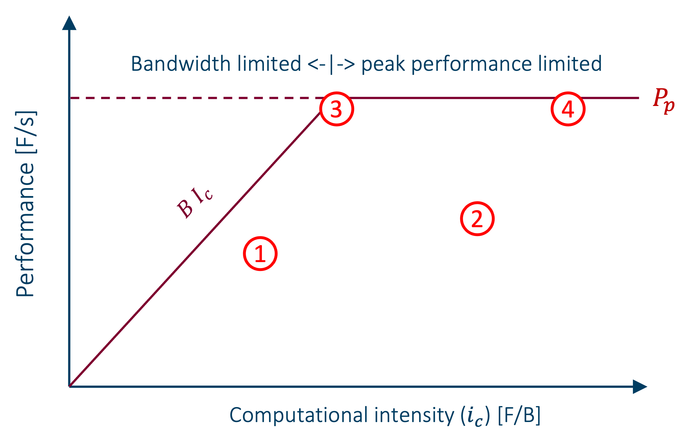

# Chapter 3 - Optimise first, then parallelize
</script>

## When to parallelize, and what to do first...

When your program takes too long, the memory of your machine is too small for your problem or the accuracy you need 
cannot be met, you're hitting the wall. Parallelization seems necessary, and you feel in need of a supercomputer.
However, supercomputers are expensive machines and resources are limited. It should come to no surprise that it is 
expected that programs are allowed to run on supercomputers only if they make efficient use of their resources. 
Often, serial programs provide possibilities to improve the performance. These come in two categories: common sense 
optimisations (often completely overlooked by researchers) which rely on a good understanding of the mathematical 
formulation of the problem and the algorithm, and code optimisations which rely on understanding processor 
architecture and compilers. Lets first look at common sense optimisations. 

## Common sense optimisations

**Common sense optimizations** come from a good understanding of the mathematical formulation of the problem and seeing 
opportunities to reduce the amount of work. We give three examples. 

### 1. Magnetization of bulk ferromagnets

I was asked to speed up a program for computing the magnetisation $m(T)$ of bulk ferromagnets as a function of 
temperature $T$. This is given by a self-consistent solution of the equations:

$$ m = \frac{1}{2 + 4\Phi(m)} $$

$$ \Phi(m) = \frac{1}{N} \sum_{\textbf{k}} \frac{1}{e^{\beta\eta(\textbf{k})m} - 1} $$

with $ \beta = 1/{k_B T} $. At $T=0$ we have $m(0) = m_0 = 0.5$, and at high $T$, $m(T)$ approaches zero.

The solution is a curve like this:

.png)

The program compute this as follows: For any temperature $T$, set $m = m_0$ as an inital guess. Then iterate $ m_
{i+1} = 1/(2 + 4\Phi(m_i)) $ until $ \Delta m = m_{i+1} - m_i $ is small. Here,

$$ \Phi(m) = \sum_{n=1}^\infty \frac{a}{\pi} \left(\int_0^{\pi/a} dq e^{-nm\beta\eta_1(q)}\right)^3 $$

and the integral is computed using Gauss-Legendre integration on 64 points.  

The choice of $m=0.5$ as initial guess is obviously a good one close to $T=0$. However, looking at the graph above, 
it becomes clear that as T increases the solution moves further and further away from $0.5$. Furthermore, if we 
compute tempurature points at equidistant tempurature points, $T_j = \delta j$ for some $\delta$ and $j=0,1,2, .
..$, it is also clear that the solution of the previous temperature point, *i.e.* $m_{j-1}$, is a far better initial 
initial guess 
guess than $m_0$. This turns out to be 1.4x faster. Not a tremendous improvement, but as the graph above seems 
continuous w e can take this idea a step further: using interpolation from solutions a lower temperature points to 
predict the next solution and use that as an initial guess. Linear interpolation of $m_j$ from $m_{j-1}$ and 
$m_{j-2}$ gives a speedup of 1.94x and quadratic interpolation from $m_{j-1}$, $m_{j-2}$ and $m_{j-3}$ a factor of 2.4x.  
That is a substantial speedup achieved without acttually modifying the code. This optimisation comes entirely from 
understanding what your algorithm actually does. Investigation of the code itself demonstrated that it made suffered 
from a lot of dynamic memory management and that it did not vectorize. After fixing these issues, the code ran an 
additional 13.6x faster. In total the code was sped up by an impressive 32.6x.

### 2. Transforming the problem domain 

At another occasion I had to investigate a code for calculating a complicated sum of integrals in real space. After 
fixing some bugs and some optimisation to improve the efficiency, it was still rather slow because the formula 
converged slowly  As the code was running almost at peak performance, so there was little room for improvement. 
However, at some point we tried to apply the Fourier transform to get an expression in frequency space. This 
expression turned out to converge much faster and consequently far less terms had to be computed, yielding a speedup 
of almost 2 orders of magnitude and was much more accurate. This is another example of common sense optimisation 
originating in a good mathematical background. The natural formulation of a problem is not necessarily the best to 
use for computation.    

### 3. Transforming data to reduce their memory footprint

I recently reviewed a Python code by the Vlaamse Milieumaatschappij for modelling the migration of invertebrate aquatic 
species in response to improving (or deteriorating) water quality. The program read a lot data from .csv files. For 
a project it was necessary to run a parameter optimisation. That is a procedure where model parameters are varied 
until the outcome is satisfactory. If the number of model parameters is large the number of program runs required can 
easily reach in the 100 000s. The program was parallellized on a single node. However, the program was using that many 
data that 18 cores of the 128 cores available on a node already consumed all the available memory. By replacing the 
data types of the columns of the datasets with datatypes with a smaller footprint, such as replacing categorical data 
with integer IDs, replacing 32-bit integers with 16-bit or even 8-bit integers, float64 real numbers with float32 or 
float16 numbers reduced the amount of data used by a factor 8. All of a sudden much more cores could be engaged in 
the computation and the simulation sped up considerably.   

Some of these "common sense optimisations" may seem obvious. Yet, of all the codes I reviewed during my career, few 
of them were immune to common sense optimisation. Perhaps, developing (scientific) software takes a special mindset: 

!!! tip 
    ***The scientific software developer mindset***: Constantly ask yourself 'How can I improve this? How can I make 
    it faster, leaner, more readable, more flexible, more reusable, ... ?'

Common sense optimisations are optimisations that in general don't require complex code analysis, require very little 
code changes and thus little effort to implement them. Yet they can make a significant contribution.

## Code optimisations

**Code optimisations** are optimisations aiming at making your solution method run as efficient as possible on the 
machine(s) that you have at your disposal. This is sometimes referred as **code modernisation**, because code that 
was optimised for the CPUs of two years a go may well need some revision for the latest CPU technology. These 
optimisations must, necessarily, take in account the specific processor architecture of your machine(s). Important 
topics are: 

- Avoid pipeline stalls (due to impredictable branches, *e.g.*) 
- Ensure SIMD vectorisation. On modern processors vector registers can contain 4 double precision floating point 
  numbers or 8 single precision numbers and vector instructions operate on these in the same number of cycles as 
  scalar instructions. Failing to vectorise can reduce the speed of your program by a factor up to 8x!   
- Smart data access patterns are indispensable for programs with a memory footprint that exceeds the size of the cache. 
  Transferring data from main memory (DRAM) to the processor's registers is slow: typical latencies are in the order 
  of 100 cycles (which potentially wastes ~800 single precision vectorised operations). Vector instructions are of 
  no help if the processing unit must wait for the data. 

This is clearly much more technical and complicated (in the sense that it requires knowledge from outside the 
scientific domain of the problem you are trying to solve). Especially fixing memory access patterns can be difficult 
and a lot ofwork, as you may have to change the data structures used by your program, which usually also means 
rewriting a lot of code accessing the data. Such code optimisations can contribute significantly to the performance 
of a program, typically around 5-10x, but possibly more. As supercomputers are expensive research infrastructure in 
high demand, we cannot effort to waste resources. That being said, the lifetime of your program is also of 
importance. If you are developing a code that will be run a few times during your Master project or PhD, using only 
a hundred of node days, and to be forgotten afterwards, it is perhaps not worth to spend 3 months optimising it.

Often, however, there is a way around these technicalities. If the scientific problem you are trying to solve, can 
be expressed in the formalism of common mathematical domains, *e.g.* linear algebra, Fourier analysis, ..., there is 
a good chance that there are good software libraries, designed with HPC in mind, that solved these problems for you. 
In most cases there are even bindings available for your favorite progamming language (C/C++, Fortran, Python, ...).  
All you have to do is translate the mathematical formulation of your problem into library calls. 

!!! tip
    ***Use HPC libraries as much as possible***. There is little chance that you will outperform them. Quite to the 
    contrary: your own code will probably do significantly worse. By using HPC libraries you gain three times:
    
    - you gain performance,
    - you gain development time as you will need a lot less code to solve your problem, less debugging, simpler 
      maintenance, ...
    - your learn how to use the library which will get you at speed readily when you take on your next 
      scientific problem.

!!! tip
    ***Don't reinvent the wheel***. The wheel was invented ~8000 years ago. Many very clever people have put effort in 
    it and is pretty perfect by now. Reinventing it will unlikely result in an improvement. By extension: if you 
    need some code, spend some time google-ing around to learn what is already available and how other researchers 
    attack the problem. It can save you weeks of programming and debugging. Adapting someone else's code to your 
    needs will learn you more than coding it from scratch. You'll discover other approaches to coding problems than 
    yours, other language constructs, idioms, dependencies to build on, learn to read someone else's code, learn to 
    integrate pieces.    

## When is code optimized enough? 

!!! Tip
    ***Premature optimization is the root of all evil*** [Donald Knuth](https://effectiviology.
    com/premature-optimization/). 

This quote by a famous computer scientist in 1974 is often used to argue that you should only optimize if there is a 
real need. If code is too slow, measurements (**profiling**) should tell in which part of the code most time is 
spent. That part needs optimision. Iterate this a few times. Blind optimisation leads to useless and developer time 
wasting micro-optimisations rendering the code hard to read and maintain. On the other hand, if we are writing code 
for a supercomputer, it better be super-efficient. But even then, depending on the lifetime of the program we are 
writing, there is a point at which the efforts spent optimising are outweighed by having to wait for the program 
going in production.

How can one judge wether a code needs further optimization or not? Obviously, there are no tricks for exposing 
opportunities for common sense optimisations, nor for knowing wether better algorithms exist. That is domain 
knowledgs, it comes with experience, and requires a lot of background. But for a given code and given input, can we 
know wether improvements are possible? In [Chapter 1][1-reduce-the-time-to-solution] we mentioned the existence of 
machine limits, the peak performance, $P_p$, the maximum number of floating point operstions that can be executed per 
second, and the bandwidth, $B$, the maximum number of bytes that can be moved between main memory and the CPU's 
registers per second. It is instructive to study how these machine limits govern the maximum performance $P_{max}$ 
as a function of the computational intensity $I_c$. If the CPU must not wait for data, $P_{max} = P_p$. In the 
situation where the bandwidth is limiting the computation $ P_{max} = BI_c$. This leads to the formula: 

$$ P_{max} = min(P_p,BI_c) $$

This is called the roofling model, since its graph looks like a roofliine.

We can measure the actual performance and computational intensity of the program and plot it on the graph. The point 
must necessarily be under the roofline. For a micro-benchmark, such as a loop with a simple body, we can compute 
$I_c$ by hand, count the Flops and time the benchmark to obtain the computational intensity. For an entire program 
a performance analysis tool can construct the graph and measure where the program is in the graph. Let's discuss 4 
different cases, corresponding to the four numbered spots in the graph above.

1. Point 1 lies in the bandwidth limited region, but well below the roofline. Something prevents the program to go 
   at the maximum performance. There can be many causes: bad memory access causing cache misses, the code may fail 
   to vectorize, pipeline stalls, ... for a micro-benchmark you can perhaps spot the cause without help. For a 
   larger program a performance analyzer will highlight the problems. 
2. Point 2 lies in the peak performance limited region, also well below the roofline. Hence, cache misses are 
   unlikely the cause. 
3. Point 3 lies close to the roofline and the boundary between the bandwidth limited region and the peak performance 
   limited region. This the sweet spot. Both peak performance and bandwith are fully used.
4. Point 4 lies close to the roofline in the peak performance limited region. This is an energy-efficient 
   computation at peak performance. It moves little data (high $I_c$). Moving data is by far the most energy 
   consuming part in a computation.

## Common approaches towards parallelization

Before we discuss common parallelization approaches, we need to explain some concepts:

- [**process** (wikipedia)](https://en.wikipedia.org/wiki/Process_(computing)): "In computing, a process is the 
  instance of a computer program that is being executed by one or more threads." A process has its own **address 
  space**, the region of main memory that can be addressed by the process. Normally, a process cannot go outside its 
  address space, nor can any other process go inside the process's own address space. An exception is when both 
  processes agree to communicate, which is the basis of distributed memory parallelism (see below). In general, a 
  process is restricted to a single node, and the maximum number of parallel threads is equal to the number of cores 
  on that node. 

- [**thread** (wikipedia)](https://en.wikipedia.org/wiki/Thread_(computing)): "In computer science, a thread of 
  execution is the smallest sequence of programmed instructions that can be managed ...". The instructions in a 
  thread are thus by definition sequential. In the context of parallel computing, parallel threads are managed by the 
  parent process to run different tasks in parallel. Obviously, parallel threads need to run on distinct cores to be 
  truely concurrent. As threads belong to a process, they can in principle have access to the entire address space of 
  the process. Sometimes a distinction is made between hardware threads and software threads. A **software thread** 
  is a set of sequential instructions for a computational task that is scheduled by the program to execute. When its 
  execution starts, it is assigned to a core. software threads can be interrupted, in order to let the core do other, 
  more urgent work, *e.g.*, and restarted. There can be many more software threads in a program than it has cores 
  available, but, obviously, they cannot all run in parallel. Software threads arre very useful in personal 
  computers with many interactive applications opened simultaneously, where are many non-urgent tasks. For HPC 
  applications they are a bit heavy weight. A **hardware thread** is a lightweight software thread that is 
  exclusively tied to a core. When given work, it can start immediately and runs to completion without interruption. 
  That is certainly useful in HPC where not loosing compute cycles is more important than flexibility.

Now that we understand the concepts of processes and threads, we can explain three different types of 
parallelization:

## Shared memory parallelization

In **shared memory parallelization** there is one process managing a number of threads to do work in parallel. As all 
the threads belong to the same process, they have access to the entire memory address space, that is, they 
*share* memory. To avoid problems, as well as for performance reasons, the variables inside a thread are *private* by 
default, *i.e.* they can only be accessed by the thread itself, and must be declare *shared* if other threads should 
have access too. Cooperating threads must exchange information by reading and writing to shared variables. 

The fact that all the threads belong to the same process, implies that shared memory programs are limited to a single 
node, because a process cannot span several nodes. However, there exist shared memory machines larger than a typical 
supercomputer node, *e.g.* [SuperDome](https://docs.vscentrum.be/en/latest/leuven/tier2_hardware/superdome_hardware.
html) at KU leuven. Such systems allow to run a shared memory program with much more threads and much more memory. 
This approach can be useful when distributed memory parallelization is not feasible for some reason. 

The most common framework for shared memory parallelization is [OpenMP](https://www.openmp.org). OpenMP 
parallelization of a sequential program is relatively simple, requiring little changes to the source code in the
form of directives. A good starting point for OpenMP parallelization is [this video](https://www.youtube.com/watch?
v=SnD8xlwLlZU). An important limitation of OpenMP is that it is only available in C/C++/Fortran, and not Python. 
Fortunately, Python has other options, *e.g.* [multiprocessing](https://docs.python.org/3/library/multiprocessing.
html), [concurrent.futures](https://docs.python.org/3/library/concurrent.futures.html) and [dask](https://www.dask.
org). In addition it is possible to build your own Python modules from C++ or Fortran code, in which OpenMP is used 
to parallelize some tasks. The popular [numpy](https://numpy.org) is a good example.

### PGAS

[PGAS](https://en.wikipedia.org/wiki/Partitioned_global_address_space), or **Partitioned Global Address Space**, 
is a parallel programming paradigm that provide communication operations involving a global memory address space on 
top of an otherwise distributed memory system.  

## Distributed memory parallelization

**Distributed memory parallelization** is the opposite of shared memory parallelization. There are many process, 
each with only a single-thread. Every process has its own memory address space. These address spaces are not shared, 
they are distributed. Therefor, explicity communication is necessary to exchange information. For processes on the 
same machine (=node) this communication is intra-node, but for processes on distinct machines messages are sent 
over the interconnect.

Distributed memory programs are considerably more complex to write, as the communication must be explicitly handled 
by the programmer, but may use as many processes as you want. Transformation of a sequential program into a 
distributed memory program is often a big programming effort. The most common framework is [MPI](https://www.mpi.org)
. MPI is available in C/C++/Fortran and also in Python by the [mpi4py](https://mpi4py.readthedocs.io/en/stable/) 
module. 

## Hybrid memory parallelization

**Hybrid memory parallelization** combines both approaches. It has an unlimited number of processes, and a number of 
threads per process, which run in parallel in a shared memory approach (OpenMP). The process communicate with each 
other using MPI. Typically, the computation is organised as one proces per NUMA domain and one thread per core in 
dat NUMA domain.  

This approach uses shared memory parallelization where it is useful (on a NUMA domain), but removes the limitation 
to a single machine. It has less processes, and thus less overhead in terms of memory footprint, and 
communication overhead. It is also a bit more complex that pure distributed memory parallelization, and much more 
complex than shared memory parallelization.

Hybrid memoryy parallelization is usually implemented with OpenMP at the shared memory level and MPI at the 
distributed level.

