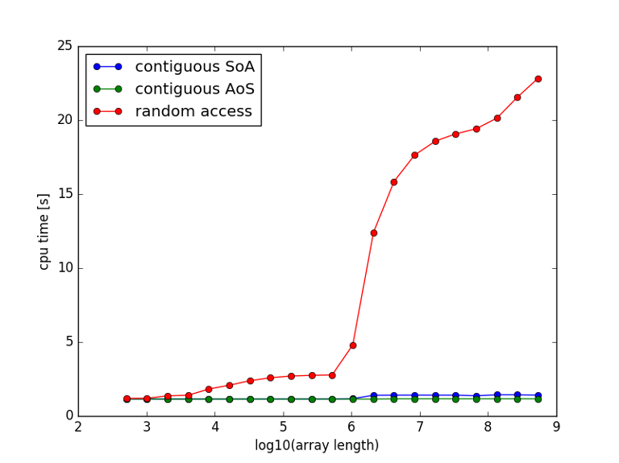
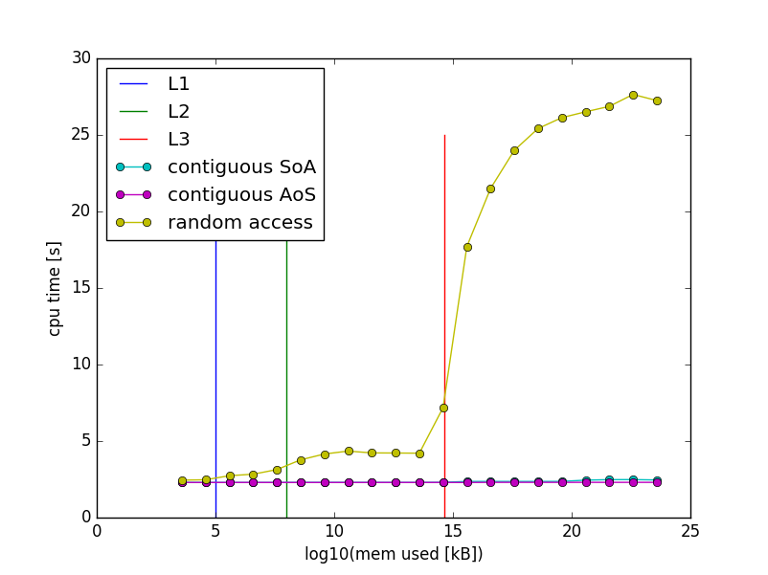
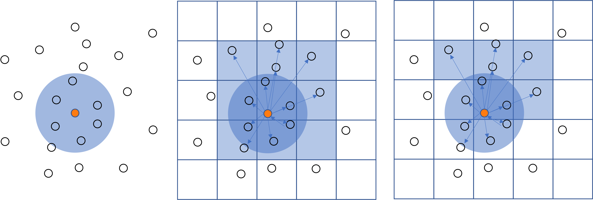

# chapter 4 - Case studies

## Monte Carlo ground state energy calculation of a small atom cluster 

### Introduction

The code for this benchmark was Kindly provided by Jesus Eduardo Galvan Moya, former PhD student of the Physics 
Department, Condensed Matter Theory.

It is a small molecular dynamics code which happens to serve many didactical purposes. It is simple code, not too big.
Full of issues you should learn to pay attention to ;-)

The goal of the program is to calculate the ground state energy of a small atomistic system of 10-150 atoms. The 
system is at 0K, so there are no velocities, and the total energy of the system consist of the interaction energy 
only. Interactions are described by a pair-wise interaction potential, without cutoff radius (brute force). 
A Monte Carlo approach is used to find the configuration with the lowest energy, 1000 separate runs with different 
initial configuration are run. Each run comprises 200 000 random atom moves. Finally, the run with the lowest energy is kept and subjected to Quasi-Newton iteration in order to find a 
local energy minimum. 

### Implementation

Here is how this algorithm goes (C++ pseudo code):   
```C++
n_atoms = 50; // (for example)
std::vector<double> x, y, z, xmin, ymin, zmin;
double Emin = std::numeric_limits<double>::max();
for(int ic=0; ic<1000; ++ic)
{// loop over initial configurations
 // generate initial configuration
    initialize(x,y,z);
    for(int ip=0; ip<200000; ++ip) 
    {// loop over random perturbations
     // perturb the current configuration    
        x += small_perturbation();
        y += small_perturbation();
        z += small_perturbation();
        E = 0;
     // double loop over all interactions
        for(int i=0; i<n_atoms; ++i)
            for(int j=0; j<i; ++j) {
                double rij = std::sqrt((x[j]-x[j])^2 + (y[j]-y[j])^2 + (z[j]-z[j])^2);
                E += V(rij);
            }
        }
    }
    if( E < Emin )
    {// remember the current (perturbed) configuration
        xmin = x;
        ymin = y;
        zmin = z;
        Emin = E
    }
} 
// Perform a Newton-Raphsom iteration on E(x,y,z) with x0 = xmin, y0 = ymin, z = zmin.   
...
```

The memory footprint of this problem is (`n_atoms` x 3) `doubles` x 8 bytes/`double`. For `n_atoms = 150`, that is 
3600 bytes, which is far less than the size of L1 cache (32KB). Hence, the problem fits easily in the L1 cache. As 
soonas the entire problem is loaded in the cache, the code will run without needing to wait for data. Furthermore, the 
interaction potential 

$$ V(r) = A \frac{exp{({\alpha}r)}}{r^n} - B \frac{exp{(-\beta(r-c_{att}))}} {(r-c_{att})^{n_{att}} + d_{att}} 
- \frac{C}{r}$$

is rather compute intensive, as it uses several expensive operations: two exponentials and two divisions, plus the 
square root for the distance which here cannot be avoided:

$$ r = r_{ij}(r_i,r_j) = \sqrt{(x_j-x_i)^2 + (y_j-y_i)^2 + (z_j-z_i)^2 } $$

Consequently, the code is certainly compute bound.

### Optimisation

Most of the work is carried out in the inner double loop over the interactions. Let's see if we can optimise this. 

Initially, both expressions for the interatomic distance $r_{ij}(r_i,r_j)$ and the interaction potential $V(r)$
were implemented as functions called in the double loop. The first timing for the double loop with 50 atoms is 144 
$\mu$s. By checking the vectorisation report of the compiler, we learned that the two function calls prohibited 
vectorisation. After inlining the functions,  the timing was reduced to 93 $\mu$s.  
The inner loop contains a lot of short loops. This is bad for pipelining and vectorisation (many loops end with 
incompletely filled vector registers.) If we split the loop in a double loop for calculating the interatomic 
distances and storing them in a long array, and a long loop over that array to compute the interactions, the 
situation might improve. 

```C++
        E = 0;
        int n_interactions = n_atoms*(n_atoms-1)/2;
        std::vector<double> rij(n_interactions); 
         // (in C++ std::vector is actually a contiguous array)
     // double loop over all interactions
        for(int i=0; i<n_atoms; ++i)
            for(int j=0; j<i; ++j) 
                rij = std::sqrt((x[j] - x[j])^2 + (y[j] - y[j])^2 + (z[j] - z[j])^2);
        }
        for(int ij=0; ij<n_interactions; ++ij)
            E += V(rij[ij]);
```
This reduces the time from 93 to 86 $\mu$s. Not much, but since we must runs this loop 1 000 x 200 000 times it 
nevertheless represents a substantial gain. 

!!! note
    We implemented this both in C++ and Fortran. The results were almost identical. You sometimes hear that C++ is 
    an inefficient programming language and that the opposite holds for Fortran. This is not true. Both C++ and 
    Fortran compilers are capable to build optimally performant progams for the CPU at hand. We'll come to this 
    subject [later](???). 

At this point, we seem to be done optimising the inner loops. Maybe there is something we can do to the 
surrounding loops? The perturbation loop adds a small perturbation to every coordinate of every atom in the list to 
see if the perturbation results in a lower energy. The perturbation involves $3n_{atoms}$ random numbers and 
generation random numbers is also rather expensive. We might wonder if it is really necessary to perturb all atoms. 
What if we perturbed only one atom? That reduces the number of random number generations by a factor $n_{atoms}$. In 
addition, most of the interactions remain the same, only the $n_{atoms}-1$ interactions with the perturbed atom 
change. Hence our program now has a complexity $O(N)$. In the original formulation the number of interaction to be 
computed was $n_{atoms}(n_{atoms}-1)/2 = O(N^2)$. As the program is compute bound changing the computational 
complexity  from $O(N^2)$ to $O(N)$ will have a big impact. This optimisation falls under the 
[common sense optimisations][common-sense-optimisations]. 

It is important to realize that this optimisation changes the nature of the algorithm. It remains to be seen whether 
200 000 configurations is still sufficient to find the minimum. We might need more, or maybe less. This up to 
the researcher to investigate. 

Let's see how we can implement this modification and how that effects the performance. We start with depicting the 
relation between $r_{ij}) as a (lower triangular) matrix and as the linear `rij` array in the split loop above. 


The linear array stores the rows of the lower triangular matrix: $[r_{10}$, $r_{20}$, $r_{21}$, $r_{30}$, $r_{31}$, 
$r_{32}, r_{40}$, $r_{41}$, $r_{42}$, $r_{43}$, ... $]$. The matrix elements show the value or the 
index into the linear array. Let's do something similar for the interaction energy:


We have added a column to compute the row sums and the total sum of the interaction energies $E_{ij}$. Let's now 
visualize the changes when an atom, say atom 4, is perturbed.


The items changing due to perturbing $r_4$ are marked in orange. The row sum for row 4 has to be computed from scratch
and in row 5 and 6 the elements corresponding to column 4 change as well. The next figure shows how the perturbed 
result can be computed from the previous result by first subtracting the previous result and then adding the new 
result. 


Here is a comparison of the timings:

| $N$        | $O(N^2)$           | $O(N)$            | speedup |
|------------|--------------------|-------------------|---------|
|  50        | 86 $\mu$s          | 5.7               | 15.1    |
| 150 (x3)   | 747 $\mu$s (x9)    | 17.3 $\mu$s (x3)  |  43.3   |
| 500 (x10)  | 8616 $\mu$s (x100) | 57.0 $\mu$s (x10) | 115.2   |

Clearly, the timings for the $O(N^2)$ algorithm increase quadratically, while those for the $O(N)$ algorithm increase 
only linearly and the speedups are substantial. The $O(N)$ algorithm for 500 atoms - a number that our researcher 
considered unattainable because it would take too long to compute - is still faster than the $O(N)$ algorithm.

!!! Tip 
    ***Look for algorithms of low computational complexity.*** However, The best algorithme may also depend on the 
    problem as we saw in [Selecting algorithms based on computational complexity]
    [selecting-algorithms-based-on-computational-complexity].  

Despite the considerable performance improvement, there are a few disadvantages to it too. The $O(N)$ algorithm has 
more code, is more difficult to understand and thus harder to maintain. Morover, its loops are more complex, making 
it harder for the compiler to optimize. Autovectorisation doesn't work. If it needs further optimization, it is 
certainly no low-hanging fruit.   

### Parallelization

If the time of solution for this sofar sequential program is still too large, we might opt for parallelization. The 
interaction loop is now doing relatively little work, and hard to parallelize. On the other hand the perturbation 
loop can be easily distributed over more threads as this loop is 
[embarrassingly parallel][what-is-a-parallel-program]. As long as every thread generates a different series of 
random numbers they can run their share of the perturbation iterations completely independent. This is very easy to 
achieve with OpenMP. In the end every thread would have its own minimum energy configuration, and the overall 
minimum energy configuration is simply found as the minimum of per thread minima. Since every core has its own L1 
cache, the problem for each thread also fits in L1. 

### Project mcgse

The `wetppr/mcgse` folder repeats this case study for the [Morse potential](https://en.wikipedia.
org/wiki/Morse_potential) (I lost the original code :-( )

$$ V(r) = D_e(1 - e^{-\alpha(r-r_e)})^2 $$

We will assume that all parameters are unity. 

$$ V(r) = (1 - e^{1-r)})^2 $$

Here is its graph:


Using our [research software devolopment strategy](chapter-5.md), we start in Python, implement both algorithms and 
test. A good test is the case of a cluster of 4 atoms. Energy minimum then consists of a tetrahedron with unit sides.
Every pair is then at equilibrium distance and $E_{min}=0$. The vertices of the tetrahedron are on a sphere of 
radius $\sqrt{3/8}$. Let us randomly distribute 4 points on a sphere of radius $\sqrt{3/8}$ and see how well close 
we get to $E_{min}=0$. 

```python
    import numpy as np
    import mcgse # our module for this project: wetppr/mcgse
	sample = mcgse.sample_unit_sphere(4) * np.sqrt(3/8)
	config = (sample[0], sample[1], sample[2]) # initial coordinates of the atoms (x,y,z)
	dist = mcgse.LogNormal(mean=-5, sigma=.4) # distribution to draw the length of the displacements from
    #   the distribution and its parameters were selected using quite some trial and error to obtain 
    #   useful results...
	Emin_ON2, *config_min_ON2 = mcgse.execute_perturbation_loop(config=config, n_iterations=20000, dist=dist, algo='ON2', verbosity=1)
	Emin_ON , *config_min_ON  = mcgse.execute_perturbation_loop(config=config, n_iterations=20000, dist=dist, algo='ON' , verbosity=1)
```

Here are the results for 5 runs:

```python
ON2 iteration 0: Emin=1.8642580817361518
ON2 iteration 200000: Emin=0.343375960680797, last improvement: iteration = 2044
ON iteration 0: Emin=1.8642580817361518
ON iteration 200000: Emin=0.1318184548419835, last improvement: iteration = 30162

ON2 iteration 0: Emin=1.0114013021541974
ON2 iteration 200000: Emin=0.368488427516059, last improvement: iteration = 32701
ON iteration 0: Emin=1.0114013021541974
ON iteration 200000: Emin=0.058861153165589014, last improvement: iteration = 5168

ON2 iteration 0: Emin=3.69912617914294
ON2 iteration 200000: Emin=0.3819530373342961, last improvement: iteration = 4580
ON iteration 0: Emin=3.69912617914294
ON iteration 200000: Emin=0.3297933435887894, last improvement: iteration = 65216

ON2 iteration 0: Emin=3.299140128625619
ON2 iteration 200000: Emin=0.5323556068840862, last improvement: iteration = 12505
ON iteration 0: Emin=3.299140128625619
ON iteration 200000: Emin=0.5270227273967558, last improvement: iteration = 16929

ON2 iteration 0: Emin=1.2894488159651718
ON2 iteration 200000: Emin=0.40188231571036437, last improvement: iteration = 2621
ON iteration 0: Emin=1.2894488159651718
ON iteration 200000: Emin=0.07936811573814093, last improvement: iteration = 25806
```

We can draw some interesting observations from these runs:

- Neither of the algorithms seem to get close to the minimum,
- In terms of closeness to the minimum there no clear winner, although `ON` got rather close twice,
- The higher the initial energy, the worse the solution, which is acceptable, as the average displacement magnitude 
  is fixed.
- None of the algorithms seems to converge. In the first and the last run `ON2` found its best guess at 2044 and 
  2621 iterations. None of the approximately 198_000 later attempts could reduce the energy. This seems to be the 
  case for `ON` as well, although the numbers are a bit higher. Despite being far from the minimum, improvements 
  seem to involve progressively more work. 

Especially the last conclusion is rather worrying. Our algorithms don't seem to sample the configuration space very 
efficiently. 

Perhaps, rather than displacing the atoms randomly, it might be more efficient to move them in the direction of the 
steepest descent of the energy surface. Since we have an analytical expression, we can compute it. The interaction 
$V(r_{ij})$ exerts a force 

$$ {\mathbf{F}}_k = -\nabla_{\mathbf{r}_k}E $$

$$ = -\nabla_{\mathbf{r}_k} \sum_{i<j}V(r_{ij}) = -\sum_{i<j}
\nabla_{\mathbf{r}_k}V(r_{ij})$$

$$= -\sum_{i<j}
\frac{d}{d_{r_{ij}}}V(r_{ij})\nabla_{\mathbf{r}_k}r_{ij} = -\sum_{i<j} V'(r_{ij})\nabla_{\mathbf{r}_k}r_{ij}$$

Here, 

$$\nabla_{\mathbf{r}_k}r_{ij} = 0 \text{  if  } k \ne i,j $$

and

$$\nabla_{\mathbf{r}_k}r_{kj} = -\frac{\mathbf{r}_{kj}}{r_{kj}} = -{\hat{\mathbf{r}}}_{kj}$$

$$\nabla_{\mathbf{r}_k}r_{jk} = \frac{\mathbf{r}_{jk}}{r_{jk}} = {\hat{\mathbf{r}}}_{jk}$$

Thus, 

Hence:

$$ \mathbf{F}_k = \sum_{j\ne{k}} V'(r_{kj}){\hat{\mathbf{r}}}_{kj} = -\sum_{j<k} V'(r_{jk}){\hat{\mathbf{r}}}_{jk} 
+ \sum_{k<j} V'(r_{kj}){\hat{\mathbf{r}}}_{kj}$$

Finally (setting all parameters to unity),  

$$ V'(r) = -2(1-e^{1-r})e^{1-r}$$

Now that we have the forces on the atoms in the current configuration, we should be able to move the atoms in the 
directon of the force, rather than in a random direction, as before. In fact we have a true minimisation problem now.

to be continued...

## Study of data access patterns in a large Lennard-Jones systems

### Introduction

In this case study we consider a large system of atoms whose interaction is described by a Lennard-Jones potential. 
By large we mean a system that does not fit in the cache. Consequently, the effect of caches will be noticabel in 
the results. We will consider two different settings. A Monte Carlo setting, as above, in which the interaction 
energy is computed as a sum of pairwise interactions. It is of little physical significance, but is useful to 
demonstrate the effect of the caches on the computations. 

The second setting is a true molecular dynamics setting in which the time evolution of a collection of atoms is 
computed by time integration of the interaction forces which are computed as the gradient of the interaction potential.
This gives rise to time dependent accelerations, velocities and positions of the atoms. 

### Monte Carlo setting

The interaction energy is given by:

$$ E=\sum_{i<j}V(r_{ij}) $$

Since our sytem is large, say billions of atoms, computing this sum considering all pairs, is computationally 
unfeasible because it has $O(N^2)$ computational complexity. We will discuss approaches to reduce the computational 
complexity to $O(N)$. To study the effect of the cache we will compute the partial sum  

$$ E_i=\sum_{j\ne{i}}V(r_{ij}) $$

for $i=0$, that is 

$$ E_0=\sum_{j=1}^{N}V(r_{0j}) $$

Because our system is translationally invariant, we can put atom $0$ at the origin, in which case $r_{0j}=r_j$. 
Thus, we end up with:

$$ E_0=\sum_{j=1}^{N}V(r_{j}) $$

We will use the best implementation for the Lennard-Jones potential that we discussed in 
[The cost of floating point instructions][the-cost-of-floating-point-instructions], expressed as a function of $r^2$,
as to avoid the square root needed to compute $r$. We consider three different cases:

1. A contiguous loop over arrays `x[1:N]`, `y[1:N]`, `z[1:N]`. This is a structure of arrays (SoA) approach.
2. A contiguous loop over a single array `xyz[1:3N`, in which the $x$, $y$ and $z$ coordinates of the $i$-th 
   atom come after each other followed by the  $x$, $y$ and $z$ coordinates of the $i+1$-th atom. This is a array of 
   structures approach (AoS).
3. A contiguous loop over arrays `x[1:N]`, `y[1:N]`, `z[1:N]` in which the atoms are picked by random permutation of 
   $1..N$. So, all atoms are visited, but in a random order. 

For each case $ E_0=\sum_{j=1}^{N}V(r_{j}) $ is computed for $N \in \{2^9,2^10,2^11,...,2^{29}\}$ repeating the loop 
over $j$ $2^{29}/N$ times. In this way the amount of interaction potential evaluations is exactly $2^{29}$ 
irrespective of the length of the array, and the timings can be compared. The smallest arrays fit in L1, while the 
longest arrays ($2^29\approx0.5\times10^9$) do not even fit in L3. Here are the timings:



It is clearly visible that the behaviour of the random case above is very different from the two contiguous cases. 
For the longest arrays, the performance is a whopping 15x worse on the random loop, yet every case performs exactly 
the same work. There burning question is of course: "what is causing the performance breakdown of the randomized 
loop"? The second question, certainly less burning, but nevertheless important, is: "is the lowest curve (the AoS 
case) the best we can get?". If you are really curious, you might wonder about the small difference between the AoS 
case and the SoA case at larger $N$. To help your understanding of the problem, here is a different representation 
of the same graph, this time the number of bytes used by the arrays on the x-axis instead of the array size $N$. 
With this x-axis it is easy to draw the boundaries of the L1, L2 and L3 caches. 



Surprisingly enough, the changes in 
the curves coincide with the cache boundaries. As soon as the problem is too large for a cache, cache misses cause 
pipeline stalls, and the CPU has to wait for the data needed. The latency increases at every cache boundary and the 
slowdown becomes more pronounced each time. This also explains the slight advantage for the AoS case over the SoA 
case for problems not fitting in L3. As x, y, and z follow contiguously in memory in the AoS case, when it needs new 
data from memory, it has to wait for only a single cache line, while the SoA needs three. If you have difficulties 
to grasp, revisit the talk by Scott Meyers [*CPU Caches and Why You Care*](https://www.youtube.com/watch?v=WDIkqP4JbkE).

The second question is a bit harder to answer. Let us analyze the performance of the (Fortran) loop:

```fortran
! Contiguous access, SoA: p=[xxx…yyy…zzz…]
do ik=1,k
    do im=1,m                           !  FLOPS
        r2 = (p(im)-x0)**2              !
            +(p(m+im)-y0)**2            !
            +(p(2*m+im)-z0)**2          ! 3-, 2+, 3*
!       r = lj_pot2(r)                  !
        r2i = 1.0d0/r2                  ! 1/
        rr6i = r2i*r2i*r2i;             ! 2*
        V0j = 4.0d0*rr6*(rr6-1.0d0);    ! 2*, 1-
    enddo                               !------------
enddo                                   ! 14 flops
```

The loop has 14 floating point operations. It is executed $2^29$ times in 1.2s. That makes $6.26\times 10^9$ flops/s.
The peak performance of the machine is 1 core x 1 instruction per cycle x 4 SIMD registers per instruction x 2.8 GHz = 
11.2 Gcycles/s = 11.2 Gflops/s. Consequently, we are running at 56% of the peak performance. So it looks as if we 
could still do better.  


Let us analyze the data traffic of the same loop:

```fortran
! Contiguous access, SoA: p=[xxx…yyy…zzz…]
do ik=1,k
    do im=1,m                           ! FLOPS         ! DATA
        r2 = (p(im)-x0)**2              !               !
            +(p(m+im)-y0)**2            !               !
            +(p(2*m+im)-z0)**2          ! 3-, 2+, 3*    ! 3DP
!       r = lj_pot2(r)                  !               !
        r2i = 1.0d0/r2                  ! 1/            !
        rr6i = r2i*r2i*r2i;             ! 2*            !
        V0j = 4.0d0*rr6*(rr6-1.0d0);    ! 2*, 1-        !
    enddo                               !---------------!-----
enddo                                   ! 14 flops      ! 24B
```
The loop reads 24 bytes x $2^29$ iterations in 1.2 s. That makes 10.7 GB/s. The bandwidth of the machine is 109 
GB/s for 10 cores, that is 10.9 GB for 1 core. Our loop runs at the maximum bandwidth. It is **bandwith saturated**. 
This is a machine limit. It can simply not feed the CPU with data faster than this. It is instructive to draw a 
roofline model for this. 


The above loop, that is the contiguous cases, plot on the bandwidth part of the roofline indicating that the machine 
limit (bandwidth) is reached, the random case sits close to the bottom far away from all machine limits. The 
conclusion is that the loop as it is runs at its maximum speed, being bandwidth limited. However, 44% of the time 
the CPU is not doing useful work, because it is waiting for data. That means that if we replaced the Lennard-Jones 
potential with another one that is about twice as compute intensive, and for that reason more accurate, we would still 
finish the computation in 1.2s and have a more accurate solution, because we are using the cycles that the CPU was 
waiting for data to do the extra computations. 

### Molecular Dynamics setting

We consider the same system, a large collection of atoms interacting through a Lennard-Jones potential. In a 
Molecular Dynamics setting the time evolution of th system is computed by time integration of the classical equation 
of motion:

$$ \dot{\mathbf{r}} = \mathbf{v} $$

$$ \dot{\mathbf{v}} = \mathbf{a} $$

$$ \mathbf{a} = \mathbf{F} $$

The forces are computed as the gradient of the interaction energy:

$$ \mathbf{F}_i = \nabla_{\mathbf{r}_i}{E} = \nabla_{\mathbf{r}_i} \sum_{j\ne{i}}^{N}V(r_{ij}) $$

We assume a system size of $N=10^9$ atoms. The number of terms in the sum above is then $10^9(10^9-1)/2\approx{10^
{18}}$. That will keep us busy, won't it... However, when you start evaluating all these contributions, you very 
soon realize that most of them are really small, so small that they don't actually contribute to the result. They 
are **short-ranged**. Mathematically, a force is short-ranged if it decays faster than $r^{-2}$. This is because the 
area of a sphere with radius $r$ is $4\pi r^2$ and hence the number of particles at distance grows as $r^2$. 
Consequently, in order for the force exerted by those particle to be negligible it has to decay faster than $r^{-2}$.

The derivative of the Lennard-Jones potential is:

$$ V'(r) = ({-6}/{r}) r^{-6}(2r^{-6}-1) $$

Hence,

$$ \mathbf{F}_i = \sum_{j\ne{i}}^{N}\nabla_{\mathbf{r}_i}V(r_{ij}) = \sum_{j\ne{i}}^{N}V'(r_{ij})\nabla_{\mathbf{r}
_i}r_{ij} = \sum_{j\ne{i}}^{N}V'(r_{ij}) \hat{\mathbf{r}}_{ij} $$

$$ = \sum_{j\ne{i}}^{N} ({-6}/{r_{ij}}) r_{ij}^{-6}(2r_{ij}^{-6}-1) \frac{\mathbf{r}_{ij}}{r_{ij}} = \sum_{j\ne{i}}^
{N} -6 r_{ij}^{-8}(2r_{ij}^{-6}-1) \mathbf{r}_{ij} $$

Note that the force factor $f$, that is the factor in front of $\mathbf{r}_ij$, can also be expressed in terms of 
$s=r^2=\delta{x}^2+\delta{y}^2+\delta{x}^2$:

$$ f(s) = -6 s^{-4}(2s^{-3}-1) $$

$$ \mathbf{F}_i = \sum_{j\ne{i}}^{N} f(s_{ij}) \mathbf{r}_{ij} $$

So, we can avoid the square root in computing $r_ij$. Clearly, we can compute the interaction energy and the 
interaction force in one go with little extra effort:

$$ V(s) = s^{-3}(s^{-3}-1) $$

$$ E = \sum_{i<j} V(s_{ij}) $$

The fact that the interaction force is short-ranged, allows us to neglect the interaction forces beyond a cutoff 
distance $r_c$, thus offering a possibility to avoid the cost of an $O(N^2)$ algorithm. 

#### Implementing cutoff

As a first step we we can avoid the computation of the interaction energy and the interaction force if $r_{ij}>r_c$, 
or $s_{ij}>s_c$:

```python
# (python psseudo-code)
for i in range(N):
    for j in range(i):
        x_ij = x[j]-x[i]
        y_ij = y[j]-y[i]
        z_ij = z[j]-z[i]
        s_ij = x_ij*x_ij + y_ij*y_ij + z_ij*z_ij
        if s_ij <= s_c:
            t = 1/s_ij
            t3 = t*t*t
            E += t3*(t3-1)
            f = -6*t*t3*(2*t3-1)
            Fx[i] += f*x_ij
            Fy[i] += f*y_ij
            Fz[i] += f*z_ij
            Fx[j] -= f*x_ij
            Fy[j] -= f*y_ij
            Fz[j] -= f*z_ij
```

Although this loop only computes the interactions wheen $s_{ij}\le{s_c}$, it still visits every pair to compute 
$s_{ij}$. The corresponding amount of work is still $O(N^2)$. Some improvement is possible by using Verlet lists.
The **Verlet list** of an atom $i$ is the set of atoms $j$ for which $r_{ij}<r_v$, where $r_v$ is typically a bit 
larger than $r_c$. The loop is now witten as:

```python
# (python psseudo-code)
for i in range(N):
    for j in verlet_list(i):
        # as above
```

The loop over $j$ is now much shorter, its length is bounded, typically in the range $10..100$. Hence, the double 
loop is effectively $O(N)$. The construction of the Verlet list, however, is still $O(N^2)$, but the cost of it is 
amortised over a number of timesteps. Because atoms move only a little bit over a time step and $r_v>r_c$, the 
Verlet list can indeed be reused a number of timesteps, before it needs to be updated. 

Algorithms for constructing the Verlet list with $O(N)$ complexity do exist. Here's a 2-D version of **cell-based 
Verlet list construction**. It can be easily extended to 3-D, but that is harder to visualise. In the left figure 
below, atom $i$ (the orange dot) is surrounded by a blue circle of radius $r_v$. Atoms inside the blue circle are in 
the Verlet list of atom $i$. We now overlay the domain with a square grid, of grid size $r_v$ (middle figure). Atom 
pairs in  the same cell or in nearest neighbour cells are Verlet list candidates, but not pairs in second nearest 
neighbours or further. To construct the Verlet list of atom $i$, we only have to test atoms in the same cell, or in 
its 8 nearest neighbours, all coloured light-blue. By iterating over all cells and over the atoms it contains, the 
Verlet lists of all atoms can be constructed with $O(N)$ complexity. In fact, by looking for pairs in all 
rearest neighbours, all candidate pairs are visited twice ($ij$ and $ji$). Hence, only half of the nearest 
neighbours needs to be visited (right figure). 



The algorithm requires that the grid implements: 

- a cell list: a list of all the atoms that are in the cell, in order to iterate over all atoms in a cell. The cell 
  lists can be constructed with $O(N)$ complexity, and 
- a method to find the neighbour cells of a cell. 

This is a good example for demonstrating the effectiveness of our 
[strategy for research software development][a-strategy-for-the-development-research-software]. Here are the steps 
you should take

0. Start out in Python.
1. Take a small system, _e.g._ $N=5$, use Numpy arrays for the positions, velocities, ...
2. Implement brute force computation of interactions and interaction forces ($O(N^2)$).
3. Implement brute force computation of interactions and interaction forces with cutoff ($O(N^2)$). 
4. Implement brute force construction of Verlet lists ($O(N^2)$). (You might need a larger system for testing this). 
5. Implement Verlet list computation of interactions and interaction forces ($O(N)$).
6. Implement cell-based Verlet list construction ($O(N)$). (You might need a larger system for testing this).
7. Optimise, try using Numba, or by taking the compute intensive parts to C++. 

8. Of course test and validate every step, _e.g._ by comparing to previous steps. 

!!! Tip
    Remember that, ***for performance***, you should ***avoid using loops in Python***. When I implemented the 
    cell-based Verlet list construction in Python, it turned out to be terribly slow, mainly because of 5 levels of 
    nesting Python loops. The C++ version turned out to be 1200x faster (twelve hundred indeed, no typo!). 

#### Moving atoms

The initalization of a physically consistent system of atoms is a non-trivial task in itself. Because molecular motion 
conserves energy, random positions and velocities at time $t=0$ may pos a lot of trouble for time integration. When 
two atoms happen to be very close they experience very high repulsive force and thus are accelerated vigorously. 
This can easily make the simulation explode. A practical way is to put atoms on a lattice with interatomic distances 
close to the equilibrium distance of the Lennard-Jones potential, _e.g._ primitive cubic, body-centred cubic (BCC), 
face-centred cubic (FCC), hexagonal closest packing (HCP). then slowly increase random velocities to increase the 
kinetice energy and hence the temperature.

When initializing the system on a lattice, often the performance is rather good because the regular arrangement 
allows for a good data access pattern. However, as (simulation) time proceeds the atoms move and diffusion kicks in. 
Every timestep, some atoms will move in and out of some other atom's Verlet sphere. Gradually, the atoms will move 
further and further from their original positions, but their location in memory does not change, and, consequentially, 
the data access pattern appproaches the random array access we discussed above, leading to considerable performance 
degradation.


