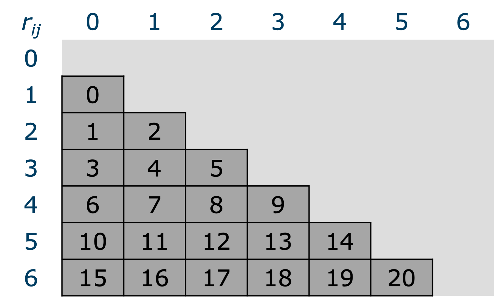
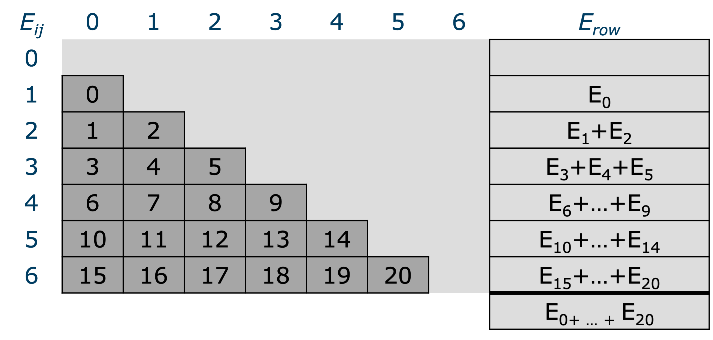
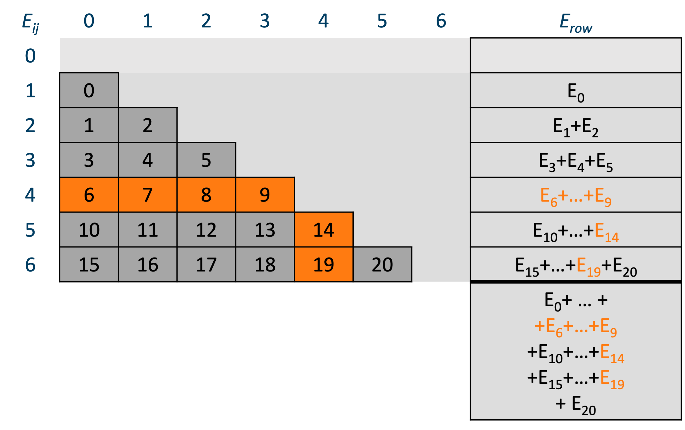
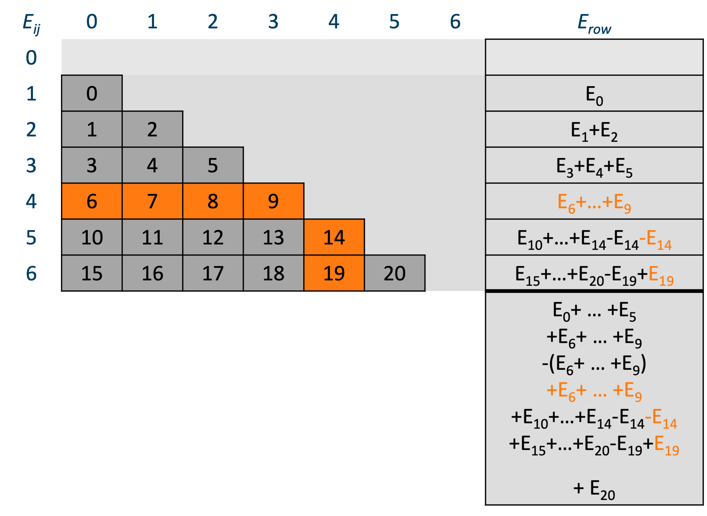
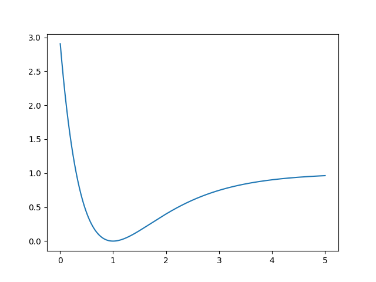

# chapter 4 - Case studies


## Monte Carlo Ground state energy calculation of a small atomistic system 

### Introduction

The code for this benchmark was Kindly provided by Jesus Eduardo Galvan Moya, former PhD student of the Physics 
Department, Condensed Matter Theory.

It is a small molecular dynamics code which happens to serve many didactical purposes. It is simple code, not too big.
Full of issues you should learn to pay attention to ;-)

The goal of the program is to calculate the ground state energy of a small atomistic system of 10-150 atoms. The 
system is at 0K, so there are no velocities, and the total energy of the system consist of the interaction energy 
only. Interactions are described by a pair-wise interaction potential, without cutoff radius (brute force). 
A Monte Carlo approach is used to find the configuration with the lowest energy, 1000 separate runs with different 
initial configuration are run. Each run comprises 200 000 random atom moves. Finally, the run with the lowest energy is kept and subjected to Quasi-Newton iteration in order to find a 
local energy minimum. 

### Implementation

Here is how this algorithm goes (C++ pseudo code):   
```C++
n_atoms = 50; // (for example)
std::vector<double> x, y, z, xmin, ymin, zmin;
double Emin = std::numeric_limits<double>::max();
for(int ic=0; ic<1000; ++ic)
{// loop over initial configurations
 // generate initial configuration
    initialize(x,y,z);
    for(int ip=0; ip<200000; ++ip) 
    {// loop over random perturbations
     // perturb the current configuration    
        x += small_perturbation();
        y += small_perturbation();
        z += small_perturbation();
        E = 0;
     // double loop over all interactions
        for(int i=0; i<n_atoms; ++i)
            for(int j=0; j<i; ++j) {
                double rij = std::sqrt((x[j]-x[j])^2 + (y[j]-y[j])^2 + (z[j]-z[j])^2);
                E += V(rij);
            }
        }
    }
    if( E < Emin )
    {// remember the current (perturbed) configuration
        xmin = x;
        ymin = y;
        zmin = z;
        Emin = E
    }
} 
// Perform a Newton-Raphsom iteration on E(x,y,z) with x0 = xmin, y0 = ymin, z = zmin.   
...
```

The memory footprint of this problem is (`n_atoms` x 3) `doubles` x 8 bytes/`double`. For `n_atoms = 150`, that is 
3600 bytes, which is far less than the size of L1 cache (32KB). Hence, the problem fits easily in the L1 cache. As 
soonas the entire problem is loaded in the cache, the code will run without needing to wait for data. Furthermore, the 
interaction potential 

$$ V(r) = A \frac{exp{({\alpha}r)}}{r^n} - B \frac{exp{(-\beta(r-c_{att}))}} {(r-c_{att})^{n_{att}} + d_{att}} 
- \frac{C}{r}$$

is rather compute intensive, as it uses several expensive operations: two exponentials and two divisions, plus the 
square root for the distance which here cannot be avoided:

$$ r = r_{ij}(r_i,r_j) = \sqrt{(x_j-x_i)^2 + (y_j-y_i)^2 + (z_j-z_i)^2 } $$

Consequently, the code is certainly compute bound.

### Optimisation

Most of the work is carried out in the inner double loop over the interactions. Let's see if we can optimise this. 

Initially, both expressions for the interatomic distance $r_{ij}(r_i,r_j)$ and the interaction potential $V(r)$
were implemented as functions called in the double loop. The first timing for the double loop with 50 atoms is 144 
$\mu$s. By checking the vectorisation report of the compiler, we learned that the two function calls prohibited 
vectorisation. After inlining the functions,  the timing was reduced to 93 $\mu$s.  
The inner loop contains a lot of short loops. This is bad for pipelining and vectorisation (many loops end with 
incompletely filled vector registers.) If we split the loop in a double loop for calculating the interatomic 
distances and storing them in a long array, and a long loop over that array to compute the interactions, the 
situation might improve. 

```C++
        E = 0;
        int n_interactions = n_atoms*(n_atoms-1)/2;
        std::vector<double> rij(n_interactions); 
         // (in C++ std::vector is actually a contiguous array)
     // double loop over all interactions
        for(int i=0; i<n_atoms; ++i)
            for(int j=0; j<i; ++j) 
                rij = std::sqrt((x[j] - x[j])^2 + (y[j] - y[j])^2 + (z[j] - z[j])^2);
        }
        for(int ij=0; ij<n_interactions; ++ij)
            E += V(rij[ij]);
```
This reduces the time from 93 to 86 $\mu$s. Not much, but since we must runs this loop 1 000 x 200 000 times it 
nevertheless represents a substantial gain. 

!!! note
    We implemented this both in C++ and Fortran. The results were almost identical. You sometimes hear that C++ is 
    an inefficient programming language and that the opposite holds for Fortran. This is not true. Both C++ and 
    Fortran compilers are capable to build optimally performant progams for the CPU at hand. We'll come to this 
    subject [later](???). 

At this point, we seem to be done optimising the inner loops. Maybe there is something we can do to the 
surrounding loops? The perturbation loop adds a small perturbation to every coordinate of every atom in the list to 
see if the perturbation results in a lower energy. The perturbation involves $3n_{atoms}$ random numbers and 
generation random numbers is also rather expensive. We might wonder if it is really necessary to perturb all atoms. 
What if we perturbed only one atom? That reduces the number of random number generations by a factor $n_{atoms}$. In 
addition, most of the interactions remain the same, only the $n_{atoms}-1$ interactions with the perturbed atom 
change. Hence our program now has a complexity $O(N)$. In the original formulation the number of interaction to be 
computed was $n_{atoms}(n_{atoms}-1)/2 = O(N^2)$. As the program is compute bound changing the computational 
complexity  from $O(N^2)$ to $O(N)$ will have a big impact. This optimisation falls under the 
[common sense optimisations][common-sense-optimisations]. 

It is important to realize that this optimisation changes the nature of the algorithm. It remains to be seen whether 
200 000 configurations is still sufficient to find the minimum. We might need more, or maybe less. This up to 
the researcher to investigate. 

Let's see how we can implement this modification and how that effects the performance. We start with depicting the 
relation between $r_{ij}) as a (lower triangular) matrix and as the linear `rij` array in the split loop above. 



The linear array stores the rows of the lower triangular matrix: $[r_{10}$, $r_{20}$, $r_{21}$, $r_{30}$, $r_{31}$, 
$r_{32}, r_{40}$, $r_{41}$, $r_{42}$, $r_{43}$, ... $]$. The matrix elements show the value or the 
index into the linear array. Let's do something similar for the interaction energy:



We have added a column to compute the row sums and the total sum of the interaction energies $E_{ij}$. Let's now 
visualize the changes when an atom, say atom 4, is perturbed.



The items changing due to perturbing $r_4$ are marked in orange. The row sum for row 4 has to be computed from scratch
and in row 5 and 6 the elements corresponding to column 4 change as well. The next figure shows how the perturbed 
result can be computed from the previous result by first subtracting the previous result and then adding the new 
result. 



Here is a comparison of the timings:

| $N$        | $O(N^2)$           | $O(N)$            | speedup |
|------------|--------------------|-------------------|---------|
|  50        | 86 $\mu$s          | 5.7               | 15.1    |
| 150 (x3)   | 747 $\mu$s (x9)    | 17.3 $\mu$s (x3)  |  43.3   |
| 500 (x10)  | 8616 $\mu$s (x100) | 57.0 $\mu$s (x10) | 115.2   |

Clearly, the timings for the $O(N^2)$ algorithm increase quadratically, while those for the $O(N)$ algorithm increase 
only linearly and the speedups are substantial. The $O(N)$ algorithm for 500 atoms - a number that our researcher 
considered unattainable because it would take too long to compute - is still faster than the $O(N)$ algorithm.

!!! Tip 
    ***Look for algorithms of low computational complexity.*** However, The best algorithme may also depend on the 
    problem as we saw in [Selecting algorithms based on computational complexity]
    [selecting-algorithms-based-on-computational-complexity].  

Despite the considerable performance improvement, there are a few disadvantages to it too. The $O(N)$ algorithm has 
more code, is more difficult to understand and thus harder to maintain. Morover, its loops are more complex, making 
it harder for the compiler to optimize. Autovectorisation doesn't work. If it needs further optimization, it is 
certainly no low-hanging fruit.   

### Parallelization

If the time of solution for this sofar sequential program is still too large, we might opt for parallelization. The 
interaction loop is now doing relatively little work, and hard to parallelize. On the other hand the perturbation 
loop can be easily distributed over more threads as this loop is 
[embarrassingly parallel][what-is-a-parallel-program]. As long as every thread generates a different series of 
random numbers they can run their share of the perturbation iterations completely independent. This is very easy to 
achieve with OpenMP. In the end every thread would have its own minimum energy configuration, and the overall 
minimum energy configuration is simply found as the minimum of per thread minima. Since every core has its own L1 
cache, the problem for each thread also fits in L1. 

### Project `wetppr/mcgse`

The `wetppr/mcgse` folder repeats this case study for the [Morse potential](https://en.wikipedia.
org/wiki/Morse_potential) (I lost the original code :-( )

$$ V(r) = D_e(1 - e^{-\alpha(r-r_e)})^2 $$

We will assume that all parameters are unity. 

$$ V(r) = (1 - e^{1-r)})^2 $$


Here is its graph:



Using our [research software devolopment strategy](chapter-5.md), we start in Python, implement both algorithms and 
test. A good test is the case of a cluster of 4 atoms. Energy minimum then consists of a tetrahedron with unit sides.
Every pair is then at equilibrium distance and $E_{min}=0$. The vertices of the tetrahedron are on a sphere of 
radius $\sqrt{3/8}$. Let us randomly distribute 4 points on a sphere of radius $\sqrt{3/8}$ and see how well close 
we get to $E_{min}=0$. 

```python
    import numpy as np
    import mcgse # our module for this project: wetppr/mcgse
	sample = mcgse.sample_unit_sphere(4) * np.sqrt(3/8)
	config = (sample[0], sample[1], sample[2]) # initial coordinates of the atoms (x,y,z)
	dist = mcgse.LogNormal(mean=-5, sigma=.4) # distribution to draw the length of the displacements from
    #   the distribution and its parameters were selected using quite some trial and error to obtain 
    #   useful results...
	Emin_ON2, *config_min_ON2 = mcgse.execute_perturbation_loop(config=config, n_iterations=20000, dist=dist, algo='ON2', verbosity=1)
	Emin_ON , *config_min_ON  = mcgse.execute_perturbation_loop(config=config, n_iterations=20000, dist=dist, algo='ON' , verbosity=1)
```

Here are the results for 5 runs:

```python
ON2 iteration 0: Emin=1.8642580817361518
ON2 iteration 200000: Emin=0.343375960680797, last improvement: iteration = 2044
ON iteration 0: Emin=1.8642580817361518
ON iteration 200000: Emin=0.1318184548419835, last improvement: iteration = 30162

ON2 iteration 0: Emin=1.0114013021541974
ON2 iteration 200000: Emin=0.368488427516059, last improvement: iteration = 32701
ON iteration 0: Emin=1.0114013021541974
ON iteration 200000: Emin=0.058861153165589014, last improvement: iteration = 5168

ON2 iteration 0: Emin=3.69912617914294
ON2 iteration 200000: Emin=0.3819530373342961, last improvement: iteration = 4580
ON iteration 0: Emin=3.69912617914294
ON iteration 200000: Emin=0.3297933435887894, last improvement: iteration = 65216

ON2 iteration 0: Emin=3.299140128625619
ON2 iteration 200000: Emin=0.5323556068840862, last improvement: iteration = 12505
ON iteration 0: Emin=3.299140128625619
ON iteration 200000: Emin=0.5270227273967558, last improvement: iteration = 16929

ON2 iteration 0: Emin=1.2894488159651718
ON2 iteration 200000: Emin=0.40188231571036437, last improvement: iteration = 2621
ON iteration 0: Emin=1.2894488159651718
ON iteration 200000: Emin=0.07936811573814093, last improvement: iteration = 25806
```

We can draw some interesting observations from these runs:

- Neither of the algorithms seem to get close to the minimum,
- In terms of closeness to the minimum there no clear winner, although `ON` got rather close twice,
- The higher the initial energy, the worse the solution,
- None of the algorithms seems to converge. In the first and the last run `ON2` found its best guess at 2044 and 
  2621 iterations. None of the approximately 198_000 later attempts could reduce the energy. This seems to be the 
  case for `ON` as well, although the numbers are a bit higher.

Especially the last conclusion is rather worrying. Our algorithms don't seem to sample the configuration space very 
efficiently. 

Perhaps, rather than displacing the atoms randomly, it might be more efficient to move them in the direction of the 
steepest descent of the energy surface. Since we have an analytical expression, we can compute it. The interaction 
$V(r_{ij})$ exerts a force 

$$ {\mathbf{F}}_k = -\nabla_{\mathbf{r}_k}E $$

$$ = -\nabla_{\mathbf{r}_k} \sum_{i<j}V(r_{ij}) = -\sum_{i<j}
\nabla_{\mathbf{r}_k}V(r_{ij})$$

$$= -\sum_{i<j}
\frac{d}{d_{r_{ij}}}V(r_{ij})\nabla_{\mathbf{r}_k}r_{ij} = -\sum_{i<j} V'(r_{ij})\nabla_{\mathbf{r}_k}r_{ij}$$

Here, 

$$\nabla_{\mathbf{r}_k}r_{ij} = 0 \text{  if  } k \ne i,j $$

and

$$\nabla_{\mathbf{r}_k}r_{kj} = -\frac{\mathbf{r}_{kj}}{r_{kj}} = -{\hat{\mathbf{r}}}_{kj}$$

$$\nabla_{\mathbf{r}_k}r_{jk} = \frac{\mathbf{r}_{jk}}{r_{jk}} = {\hat{\mathbf{r}}}_{jk}$$

Thus, 

Hence:

$$ \mathbf{F}_k = \sum_{j\ne{k}} V'(r_{kj}){\hat{\mathbf{r}}}_{kj} = -\sum_{j<k} V'(r_{jk}){\hat{\mathbf{r}}}_{jk} 
+ \sum_{k<j} V'(r_{kj}){\hat{\mathbf{r}}}_{kj}$$

Finally (setting all parameters to unity),  

$$ V'(r) = -2(1-e^{1-r})e^{1-r}$$
