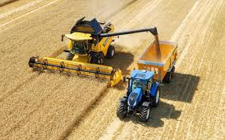

## [Engel]bert Tijskens

---

- Lic. Aard- en delfstofkunde, *Master in Physics of Microelectronics and Material Sciences*, Doctor in de 
  Natuurwetenschappen - ik heb dus eigenlijk geen opleiding genoten in programmeren of wetenschappelijk rekenen ... 
  maar veel opleidingen bijgewoond, en vooral veel gelezen tijdens mijn voortdurende zoektocht naar betere manieren 
  om de opdrachten waar ik voor stond uit te voeren.  
- ik werk sinds 2012 voor **[CalcUA](https://www.uantwerpen.be/en/research-facilities/calcua/)**, de UA 
  kernfaciliteit voor supercomputing, en voor het [VSC](https://vscentrum.be), het **Vlaams Supercomputer Centrum**.  
  Ik verzorg er opleiding en ondersteuning van onderzoekers rond wetenschappelijk programmeren voor HPC-omgevingen 
  en performantie-analyse. k ben gepassioneerd door **Python**, **C++**, **Fortran** en *libraries* en frameworks 
  waarmee hoog-performante en parallelle applicaties kunnen gebouwd worden.
- Sinds 2014 geef ik het vak "Parallel programmeren". Ik geef graag les en wil mijn ervaring van 30 jaar 
  wetenschappelijk programmeren delen met jonge onderzoekers.
- Voor 2012 leidde ik de **DEM Research Group** aan de KU Leuven. DEM staat voor ***Discrete Element Modelling***. 
  Je kan het vergelijken met ***Molecular Dynamics***, maar dan in de macroscopische wereld met atomen die een vorm 
  hebben, korrels dus, of *grains* in het Engels. Daarom wordt het ook ***Granular Dynamics*** genoemd. 
  Korrelstromen komen in heel wat industriële processen voor en het modelleren ervan is interessant, om inzicht te 
  verwerven in korrelige processen en om er goede procesinstallaties voor te ontwerpen. Dit is erg uitdagend omdat de 
  fysica van korrelige processen zo complex is. In tegenstelling tot MD zijn interacties tussen korrels dissipatief 
  en worden de contactkrachten bepaald door materiaaleigenschappen en oppervlakte-eigenschappen en zijn er zowel 
  normale als tangentiële contactkrachten (wrijving). Bovendien zijn de korrels - afhankelijk van het materiaal - 
  soms vervormbaar, of zelfs breekbaar. Omdat korrelige processen vaak over heel veel deeltjes gaan, zijn 
  performantie en parallellisatie essentieel. De simulatiesoftware waar we toen aan werkten, wordt nu 
  gecommercialiseerd door **[Mpacts](https://mpacts.com)**. 

---

## Enkele voorbeelden

Kijk op [Mpacts case studies](https://mpacts.com/case-studies.html) voor meer voorbeelden. 

### CNH maaidorser - ontwikkeld met Mpacts

Hier zijn verscheidene korrelige processen aan de orde:

- de strohalmen maaien en binnen trekken in de machine,
- de graantjes losmaken van de aar en ze scheiden van het stro,
- stro afvoeren naar achter,
- het kaf van het koren scheiden (kaf weg blazen),
- het graan transporteren naar de verzamelbak bovenaan de machine,
- het graan transporteren van de verzamelbak naar de aanhangwagen achter de tractor,

### Spherische korrels die op een trampoline vallen

### Mpacts: ijsbreker

Mpacts simulatie van een ijsbreker die door een ijslaag breekt.

