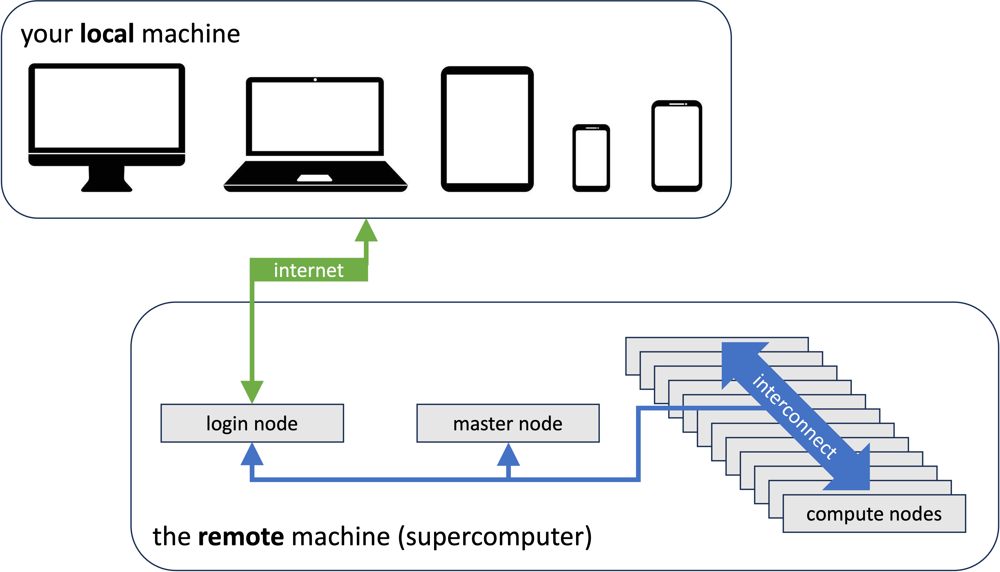

# VSC infrastructure

This document describes how to set up your environment for the [project work of the 2000wetppr course](evaluation.md)
on the Tier-2 cluster of the University of Antwerp, which is also a VSC cluster. With minor modifications this can
be applied to all VSC clusters. In general, the text is also applicable to other HPC clusters, but the modifictions
needed may be a bit more substantial.

!!! Note "Note for students"
    These topics are logically ordered. Make sure that you carry out ***all*** the tasks in the order described.

## A bit of terminology

In this course we often use the terms _local_ and _remote_. The term **local** refers to the physical machine you are
working on, _i.e._ your desktop or laptop, or even a tablet or cell phone. On the other hand **remote** refers to a machine which is usually in some other place, and which you are accessing from your local machine through a network connection (usually the internet) with the remote machine. In this course the remote machine is the university's Tier-2 supercomputer, _Vaughan_, at the time of writing. 



The supercomputer, basically, consists of:

* One or more **login nodes**. When users logs in to the supercomputer, a connection is established between the user's local machine and a login node. This is where users execute simple, not computationally intensive tasks, _e.g._:

    * job preparation,

    * organization of the workspace and projects,

    * create input data,

    * software development tasks,

    * small tests,

    * ...

* A collection of **compute nodes**, potentially many thousands. This is where computationally intensive tasks of the users are executed. Typically, the user has no direct connection to the compute nodes.

* One or more **master nodes**. The master node runs the **resource manager** and the **scheduler**> and is the connection between the login node and the compute nodes. The former keeps an eye on what the compute nodes are doing and whether they are ready to accept new computational tasks. The scheduler does the planning of that work.

To carry out some computational work on the compute nodes, the user must send a request to the scheduler, describing the task, the environment in which that task must be executed, and the resources (number of nodes, memory, accelerators, ...) needed by the task. Such a request is called a **job script** and the task is referred to as a **job**.

## Preparing for the VSC infrastructure in 2000WETPPR

### Applying for a guest account

!!! Note
    This section is ***only for students of the course 2000wetppr***.

    Students of the course 2000wetppr must apply for a guest account to access the university's HPC clusters, unless they already have a VSC account. The project work (see [Evaluation](evaluation)) requires access to one of the university's HPC clusters.

To apply for a guest account, create a SSH public/private key pair (see below) and send it by e-mail to ``franky.backeljauw@uantwerpen.be`` with ``engelbert.tijskens@uantwerpen.be`` in cc. A guest account will subsequently be created for you.

### Applying for a VSC account

!!! Note
    This section is ***only for researchers of Flemish institutes***.

Researchers of Flemish research institutes can apply for a VSC account to get access to the VSC Tier-2 and Tier-1 supercomputers. See [Getting access to VSC clusters](https://docs. vscentrum.be/en/latest/access/getting_access.html). An ssh public/private key pair is also required.

### Creating an ssh public/private key pair

An ssh public/private key pair in necessary for both a guest account (students) and a VSC account (researchers).

A ssh public/private key pair is a way for secure access to a system through the Secure Shell protocol. They are basically two small files with matching numbers. You may think of the public key as a lock. Everyone is allowed to see the lock, but no one can open the lock without its key, which is the private part of the key pair. The public key (the lock) will be placed on a system you need access to, in this case the Tier-2 supercomputer of our university. To access to the supercomputer (_i.e._, to open the lock) from, say, your laptop, you need the private key to be stored on your laptop (or a USB memory stick) and pass it to the SSH protocol, which will verify that the private key and the public key match. If case they do, the SSH protocol will open the lock and grant you access to the machine.

To create a ssh public/private key pair proceed as follows. Open a 'terminal'.

!!! Note "On Windows"
    The latest builds of Windows 10 and Windows 11 include a built-in SSH server and client that are based on OpenSSH. You can use the `cmd` prompt, powershell, or WSL (Windows subsystem for Linux) as a terminal. For older Windows versions, we recommend installing [mobaxterm](https://docs.vscentrum.be/en/latest/access/access_using_mobaxterm.html#access-using-mobaxterm) to generate a ssh public/private key pair.

!!! note "On Linux"
    Most Linux distributions have a `terminal` application.

!!! note "MacOSX"
    MacOSX comes with a build in `Terminal.app`. `iTerm2` is a replacement for `Terminal.app` with many interesting extra features.

Type the following command at the prompt:

```shell
> ssh-keygen -t rsa -b 4096
```

You will then be prompted for a file location of the public and private key. You may accept the default location by entering. The default file location will look a bit different, depending on your OS. If the files already exist you can choose to overwrite them or to cancel the operation. You might want to change the filename of the key to a more meaningfull name, _e.g._ `access_vaughan_rsa`. Don't use blanks in the filename. Use hyphens (`-`) or underscores (`_`) instead.

```
Enter file in which to save the key (C:\Users\your_username/.ssh/id rsa) :
C:\Users\your_username/.ssh/id rsa already exists.
Overwrite (y/n)? y
```

You will then be prompted for a passphrase (twice). A passphrase provides an extra level of protection in case somebody would steal your private key. Press `enter` for an empty passphrase. (Passphrases are a little annoying when using VS Code (see below) for remote development.)

```
Enter passphrase (empty for no passphrase):
Enter same passphrase again:
```

Finally you will be notified of where the keys are stored:  

```
Your identification has been saved in C:\Users\your_username/.ssh/id rsa.
Your public key has been saved in C:\Users\your_username/.ssh/id rsa.pub.
```

!!! Note "For students of 2000wetppr"
    To obtain a guest account, students must send their ***public*** key (and ***only*** the public key, the private
 key is, well, um, _private_) to `franky.backeljauw@uantwerpen.be` with `engelbert.tijskens@uantwerpen.be` in _cc_. The public key is the one with the `.pub` extension.

### Accessing Vaughan

#### Terminal based access

Vaughan is (at the time of writing) the University of Antwerp's Tier-2 HPC cluster. For terminal based access you
open a `terminal` (see above) and execute the command:

```
> ssh -i path/to/my/private-ssh-key your-user-id@login1-vaughan.hpc.uantwerpen.be
Last login: Mon Feb 27 12:40:32 2023 from 143.129.75.140
--------------------------------------------------------------------
Welcome to VAUGHAN !
...
```

!!! Note
    If the key is in sub-directory `.ssh` of your home directory, the `-i path/to/my/private-ssh-key` can be omitted.

The `ssh` command above, connects your terminal session to a _login node_ (see above) of the Vaughan cluster. 
After the command is finished, you can use the terminal as if you were working on the login node. The current working directory will be a location in your file system on the cluster, rather than on your local machine. Vaughan has two login nodes, `login1-vaughan.hpc.uantwerpen.be` and `login2-vaughan.hpc.uantwerpen.be`. You can also
use `login-vaughan.hpc.uantwerpen.be`. The system then will choose the login node with the highest availability.

`Ssh` comes with a `.ssh/config` file that allows you to store the arguments of frequently used ssh commands. E.g.

```shell
# file ~/.ssh/config
Host vn1
  HostName login1-vaughan.hpc.uantwerpen.be
  User vsc20170
  IdentityFile /full/path/to/my/private-ssh-key
  IdentitiesOnly yes
  ForwardX11 yes
  ForwardX11Trusted yes
  ServerAliveInterval 60
```

which allows to abbreviate the above `ssh` command as `ssh vn1`. The `config` file can contain several `Host` entries.

#### IDE based access

While editing files in terminal based access is very well possible using terminal editors, e.g. `vim` or `nano`,
Many developers find code development using terminal based access rather cumbersome. IDEs (Integrated Development environment) provide a more user-friendly GUI based experience. [Visual Studio Code](https://visualstudio.com) provides a very reasonable user experience for both local aand remote development, providing a project directory tree, an editor pane, syntax highlighting, a debugging pane, a terminal, ... It is very well suited for our project work. So, install [Visual Studio Code](https://visualstudio.com) on your local machine. (It is available for Windows, Linux, and MacOSX).

Here are some useful VS Code extensions that you
should install. Click the `Extensions` icon in the activity bar on the left. You can search the Marketplace for
interesting extensions.


!!! Tip "Necessary extensions"

    - Remote Development

!!! Tip "Highly recommended extensions"

    - Python extension for Visual Studio Code
    - Python extension pack

!!! Tip "Recommended extensions for C++"

    - C/C++
    - Better C++ syntax
    - CMake
    - CMake tools

!!! Tip "Recommended extensions for Fortran"

    - Modern Fortran

There is a helpfull tutorial on [Using VS Code for Remote Development](presentations/TNT-VS Code.pptx), but before 
getting your hands dirty, please complete the steps below first.

#### VS Code fails to connect due to `file quota exceeded`

VS Code Remote installs some machinery in your home directory (`~/.vscode-server`) of the remote machine you are using. As VS Code can easily create a lot of files remotely, this can easily cause `file quota exceeded` on your `user` file system. When accessing the cluster through VS Code, you will probably only notice that VS Code fails to connect with the cluster. Log in on the cluster from a terminal with `ssh` and run  

```shell
> ./path/to/wetppr/scripts/mv.vscode-server.sh
```

This moves the `.vscode-server` directory from your home directory to $VSC_DATA where file quota are much larger and cannot cause problems.

### Setting up your remote environment

#### LMOD modules

A HPC cluster provides you with many installed software packages. However, none of them are immediately available. To make a package available, you must `load` the corresponding software module. (These modules, also known as **LMOD modules**, are a different _module_ kind than the Python modules). In the project directory ``scripts/vaughan/`` you find a script ``env-lmod.sh`` that can be sourced to load a set of commonly used LMOD modules in this course.  Additional modules can be loaded as ``module load <module-name>``, or the shorthand ``ml <module-name>`` . Sourcing a script differs from executing it in that it modifies the current environment ([see _e.g. this](https://superuser.com/questions/176783/what-is-the-difference-between-executing-a-bash-script-vs-sourcing-it)). A script is sourced through the **source** command:

```shell
> cd path/to/wetppr 
> source scripts/vaughan/env-lmod.sh
Using toolchain_name foss/2022a 

module load calcua/2022a
module load foss
module load SciPy-bundle
module load numba
wip-tools dependencies:
module load CMake
module load git
module load gh
```

The `env-lmod.sh` script can be used to load the modules for different toolchains and versions:

```shell
> source scripts/vaughan/env-lmod.sh intel # => intel/2022a
> source  scripts/vaughan/env-lmod.sh foss/2023a # => foss/2022a
```

The **foss** toolchain uses the GCC compilers to build software, whereas the **intel** toolchain uses the Intel compilers.

!!! tip
    The `source` command can be abbreviated as `.`.

!!! Tip
    Sourcing a script modifies your environment for the time of your shell session. Every time you start a new shell session, you must reload these modules. Initially, it might be tempting to source the script in your `.bashrc`. However, soon you will discover that such scripts depend on the project you are working on, and that it is better to have it somewhere in your project directory.

!!! tip
    In order to be able to execute a shell script, it must be made **executable** (`chmod +x <path/to/script>`). Shell scripts that intend to modify the environment, like `env-lmod.sh`, and thus must be sourced, need not be executable. If you do not make the script executable, it can only be sourced. In this way you avoid the surprises from an unmodified environment after executing a script that expect to be sourced. (There are also [tricks to detect if a script is being sourced(https://stackoverflow.com/questions/2683279/how-to-detect-if-a-script-is-being-sourced)] or not.)

#### Wiptools

[Wiptools](https://etijskens.github.io/wiptools) is a Python package that can simplify your project management considerably. If you haven't already done so, source the `env-lmod.sh` script  above and install wip-tools in a (remote) terminal as:

```shell
> pip install --user wiptools
...
```

If you are interested in building binary extension modules from C++, you should also install `nanobind`

```shell
> pip install --user nanobind
...
```

!!! note
    The `--user` flag instructs `pip` to install the package in the directory defined by the environment variable `${PYTHONUSERBASE}`. The default install path of `pip` is a system location for which you do not have write permissions. Omitting `--user` would raise a `PermissionError`. When installing on your local machine, the `--user` flag may be omitted.

!!! warning
    Before starting to use `wiptools`, checkout these [prerequisites](https://etijskens.github.io/wiptools/installation/#prerequisites).

## Submitting jobs on Vaughan

Unlike your personal computer, which you use mainly **interactively**, a supercomputer is mostly used in **batch mode**. To execute some computational work, you send a request to the **scheduler** specifying the work and how you want it to be executed. This means you need to specify

* the resources you need,

* how the environment must be set up, _i.e._ necessary LMOD modules and environment variables, and

* the command(s) you want to execute.

Such a request is called a **job script**. The scheduler decides which compute nodes will be used for your job and when it will be started, based on a fair share policy and the availability of the resources of the cluster. 

Most modern supercomputers - Vaughan included - use [Slurm](https://slurm.schedmd.com) for resource management and 
scheduling. An extensive description about using Vaughan can be found [here](https://calcua.uantwerpen.be/courses/hpc-intro/IntroductionHPC-20230313.pdf).

#TODO: ## fix link and code (mpi+openmp)

Here is a simple job script 
(You can find it in the 
``wetppr/scripts/vaughan_examples`` directory of the [wetppr github repo](https://)):

```shell
#!/bin/bash                               # 1 Shebang
#SBATCH --nodes=2                         # 2 SLURM job script parameters
#SBATCH --ntasks=64 --cpus-per-task=2     # 2 
#SBATCH --time=00:05:00                   # 2
#SBATCH --mail-type=BEGIN,END,FAIL        # 2
#SBATCH -–mail-user=<your e-mail address> # 2
#SBATCH --job-name mpi4py_hello_world     # 2
#SBATCH -o %x.%j.stdout                   # 2
#SBATCH -e %x.%j.stderr                   # 2

module --force purge                      # 3 Setup execution environment
module load calcua/2020a                  # 3
module load intel                         # 3
module list                               # 3

# build the program _build/hello-mpi-omp
module load CMake
mkdir -p _build
cd _build
cmake ..
cmake --build .
cd ..

# set some environment variables to distribute the cpus optimally over the MPI processes
export OMP_PROC_BIND=true
export I_MPI_PIN_DOMAIN=omp,compact
export OMP_NUM_THREADS=$SLURM_CPUS_PER_TASK

# run the program _build/hello-mpi-omp onl the requested resources
srun --quiet -n${SLURM_NTASKS} -c${SLURM_CPUS_PER_TASK} --exclusive --unbuffered _build/hello-mpi-omp
```

The job is submitted for execution by executing this command in a terminal running a session on a login node:

```shell
> cd path/to/wetppr/scripts/vaughan_examples
> sbatch mpi4py_hello_world.slurm
```
(Note that we first cd into the directory containing the job script.) If all goes well, ``sbatch`` responds with something like

```shell
Submitted batch job 709521
```

Where ``709521`` is the job id. 

The job is now in the job queue. You can check the status of all your submitted jobs with the ``squeue`` command:

```shell
> squeue
             JOBID PARTITION     NAME     USER ST       TIME  NODES NODELIST(REASON)
           1154283      zen2 hello-mp vsc20170 PD       0:00      2 (Priority)
```
The ``ST`` column shows the status of your job. ``PD `` means 'pending', the job is waiting for resource allocation. 
It will eventually run. Once running, it will show ``R`` as a status code and the ``TIME`` column will show the 
walltime of the job. Once completed the status will be 'CD' and after some minutes, it will disappear from the 
output of the ``squeue`` command. The directory ``wetppr/scripts/vaughan_examples`` now contains two extra files:

```shell
> ls -l
total 12
total 36
drwxrwxr-x 3 vsc20170   134 Oct  5 09:11 _build/
-rw-rw-r-- 1 vsc20170   488 Oct  4 18:31 CMakeLists.txt
-rw-rw-r-- 1 vsc20170     0 Oct  5 09:11 hello-mpi-omp.1154283.stderr
-rw-rw-r-- 1 vsc20170 19791 Oct  5 09:12 hello-mpi-omp.1154283.stdout
-rw-rw-r-- 1 vsc20170  2589 Oct  5 08:50 hello-mpi-omp.c
-rw-rw-r-- 1 vsc20170   496 Oct  5 08:44 hello-mpi-omp.slurm
-rwxrwxr-x 1 vsc20170   430 Oct  5 09:57 sort.py*
```

File ``hello-mpi-omp.1154283.stderr`` contains the output written by the job to stderr. If there are no errors, it 
is generally empty, as indicated here by the 0 file size. File ``hello-mpi-omp.1154283.stdout`` contains the output 
written by the job to stdout. The `module list` command produces an overview of all loaded modules:

```shell
Currently Loaded Modules:
  1) calcua/2022a                    7) UCX/1.12.1-GCCcore-11.3.0
  2) GCCcore/11.3.0                  8) impi/2021.6.0-intel-compilers-2022.1.0
  3) zlib/1.2.12-GCCcore-11.3.0      9) imkl/2022.1.0
  4) binutils/2.38-GCCcore-11.3.0   10) iimpi/2022a
  5) intel-compilers/2022.1.0       11) imkl-FFTW/2022.1.0-iimpi-2022a
  6) numactl/2.0.14-GCCcore-11.3.0  12) intel/2022a
```

Then there is some output produced by the CMake commands building the program `_build/hello-mpi-omp` that 
subsequently is run in parallel on the requested resources. This produces a series of lines starting with 
`Host=...`. Each MPI process produces  line like:

```
Host=r2c06cn3.vaughan  Pid=814085  MPI_rank=000/064                      CPU=0
```

printing, respectively, 

* the name of the compute node on which the mpi process runs (`Host=...`), 
* the process ID of the process (`Pid=...``), 
* the MPI rank of the process and the total number of MPI ranks (`MPI_rank=xxx/nnn`), and 
* the CPU ID on which the proces runs (`CPU=...`).

The MPI process also has an OpenMP parallel section which prints a line for every OpenMP thread 
involved in that parallel section (there is 2 of them  in this case):

```
Host=r2c06cn3.vaughan  Pid=814085  MPI_rank=000/064  OMP_thread=000/002  CPU=000  NUMA_node=0  CPU_affinity=0,
Host=r2c06cn3.vaughan  Pid=814085  MPI_rank=000/064  OMP_thread=001/002  CPU=001  NUMA_node=0  CPU_affinity=1,
```

Each line contains, respectively, 

* the name of the compute node on which the mpi process runs (`Host=...`), 
* the process ID of the process (`Pid=...``), 
* the MPI rank of the process and the total number of MPI ranks (`MPI_rank=xxx/nnn`), and 
* the OpenMP thread number of the thread in the parallel section (`OMP_thread=...`).

The lines following ``Currently Loaded Modules:`` represent the output of the ``module list`` command. The 
subsequent lines ``rank=<rank>/64`` represent the output of the ``print`` statement in the ``mpi4py_hello_world.py`` script.
Each rank produces one printed line in random order (this is because of OS jitter). 

The job script has four sections:

- the shebang
- SLURM job script parameters 
- setup of the job's execution environment
- the actual job commands 

### Shebang

The first line, starting with ``#!`` is the [_shebang_](https://linuxhandbook.com/shebang/)). It is mandatory and sets the system ``bash`` 
as the interpreter of the job script:  

```shell
#!/bin/bash
```

### SLURM job script parameters

After the *shebang* the Slurm job script parameters are specified. They all start with ``#SBATCH``.
The second line selects the number of tasks (processes) and cpus per process to be used for your job:

```shell
#SBATCH --nodes=2
#SBATCH --ntasks=64 --cpus-per-task=2
```

Here, 2 compute nodes are requested for 64 MPI processes , each process using 2 cpus for each process. 
Since the compute nodes of Vaughan have 64 cores, this corresponds to requesting two entire nodes. 
Typically, processes communicate via MPI and the cpus of a process via OpenMP.  

Furthermore, we need to specify how long we suspect the job to run:

```shell
#SBATCH --time=00:05:00
```

Here, we request 5 minutes. If the job is not finished after five minutes, it will be aborted. The maximum wall time 
for a job is 72 hours. Longer jobs must be split into pieces shorter than 72 hours. Jobs of 1 hour or less have high 
priority than longer jobs.

Larger jobs typically do not start immediately. First, the requested resources must be available. Moreover, your
job must be the next in the queue, which is formed on a fair share basis. To know when your job starts and ends, you 
can ask the scheduler to send you an e-mail. Here, we request that an e-mail is sent when the job starts, 
ends and also when it fails for some reason.

```shell
#SBATCH --mail-type=BEGIN,END,FAIL
#SBATCH -–mail-user=<your e-mail address>
```

If you leave out the ``--mail-user``, the e-mail address 

Finally, it is convenient to specify a name for the job and its output files. 

```shell
#SBATCH --job-name mpi4py_hello_world
#SBATCH -o %x.%j.stdout
#SBATCH -e %x.%j.stderr
```

As the job script is executing the Python script ``mpi4py_hello_world.py`` and was therefor named ``mpi4py_hello_world.slurm``,
the job name is correspondingly set to ``mpi4py_hello_world``. The output to ``stdout`` and ``stderr`` is then redirected
to ``mpi4py_hello_world.<jobid>.stdout`` and ``mpi4py_hello_world.<jobid>.stderr``, resp. This ensures that an alphabetical 
listing of files will group all files corresponding to and produced by this job script. 

### Setup of the job's execution environment

We prefer to start from a clean environment:

```shell
# module --force purge
```

Then we load a toolchain:

```shell
# module load calcua/2020a
```

(More recent toolchains are upcoming).

Next, we load the LMOD modules we need:

```shell
# module load Python/3.8.3-intel-2020a
```

This LMOD module comes with a whole bunch of pre-installed python modules, including numpy, mpi4py, scipy, ...

It is also useful to print which modules we have loaded, to leave a trace of the environment in which the 
job is executed for later reference.:

```shell
# module list
```

### Job execution commands 

The job script ends with a list of (``bash``) commands that compose the job: 

```shell
srun python mpi4py_hello_world.py
```

The ``srun`` command calls mpirun with the resources requested in the [Job script parameters][slurm-job-script-parameters]
. Consequentially, 64 MPI processes will be started, one on each core of a compute node. Their ranks will be 
numbered 0..63.

# Recommended steps from here

* A helpfull tutorial on [Using VS Code for Remote Development](presentations/TNT-VS Code.pptx)
* The [micc2 tutorials](https://et-micc2.readthedocs.io/en/stable/tutorials.html)
