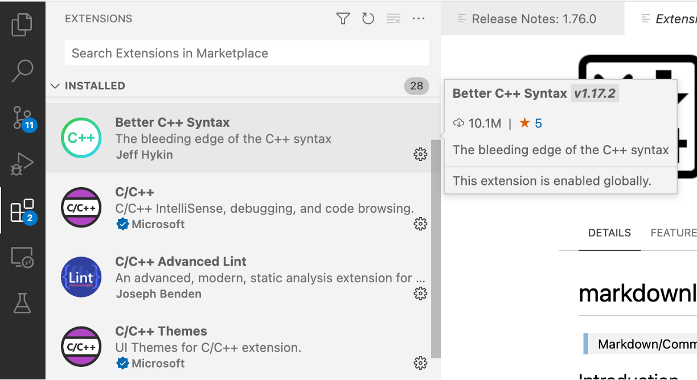

# VSC infrastructure

This document describes how to set up your environment for the [project work of the 2000wetppr course](evaluation.md)
on the Tier-2 cluster of the University of Antwerp, which is also a VSC cluster. With minor modifications this can 
be applied to all VSC clusters. In general, the text is also applicable to other HPC clusters, but the modifictions 
needed may be a bit more substantial.

!!! Note "Note for students"
    These topics are logically ordered. Make sure that you carry out ***all*** the tasks in the order described.

In this course we often use the terms _local_ and _remote_. ***Local*** refers to the physical machine you are 
working on, _i.e._ your desktop or laptop. ***Remote***, on the other hand refers to a machine which is, typically, 
at some other place, and which you are accessing through your local machine and a network connection with the remote 
machine.

## Applying for a guest account

!!! Note
    This section is ***only for students of the course 200wetppr***.
    
    Students of the course 2000wetppr must apply for a guest account to access the university's HPC clusters unless 
    they already have a VSC account. The project work (see [Evaluation](evaluation)) requires access to one of the 
    university's HPC clusters. 

To apply for a guest account, create a SSH public/private key pair (see below) and send it by e-mail to
franky.backeljauw@uantwerpen.be with engelbert.tijskens@uantwerpen.be in cc. A ***guest account*** will subsequently 
be created for you. 

## Applying for a VSC account 

!!! Note
    This section is ***only for researchers of Flemish institutes***.

Researchers of Flemish research institutes can apply for a VSC account to get access to the VSC Tier-2 and Tier-1 
supercomputers. See [Getting access to VSC clusters](https://docs. vscentrum.be/en/latest/access/getting_access.html).
An ssh public/private key pair is also required.

## Creating an ssh public/private key pair

An ssh public/private key pair in necessary for both a guest account (students) and a VSC account (researchers).

A ssh public/private key pair is a way for secure access to a system through the Secure Shell protocol. They are
basically two small files with matching numbers. You may think of the public key as a lock. Everyone may see the
lock but no one can open the lock without its key, which is the private part of the key pair. The public key
(the lock) will be placed on a system you need access to, in this case the Tier-2 supercomputer of our university
(currently, that is [Vaughan](https://docs.vscentrum.be/en/latest/antwerp/tier2_hardware/vaughan_hardware.html?
highlight=vaughan)). To access to the supercomputer (_i.e._, to open the lock) from, say, your laptop, you need the
private key to be stored on your laptop (or a USB memory stick) and pass it to the SSH protocol, which will verify
that the private key and the public key match. If case they do, the SSH protocol will open the lock and grant you 
access to the machine.

To create a ssh public/private key pair proceed as follows. Open a 'terminal':

!!! Note "On Windows"
    The latest builds of Windows 10 and Windows 11 include a built-in SSH server and client that are based on 
    OpenSSH. You can use the `cmd` prompt, powershell, or WSL (Windows subsystem for Linux) as a terminal. For older 
    Windows versions, we recommend installing 
    [mobaxterm](https://docs.vscentrum.be/en/latest/access/access_using_mobaxterm.html#access-using-mobaxterm).
    to generate a ssh public/private key pair.

!!! note "On Linux"
    Most Linux distributions have a `terminal` applicaton. 

!!! note "MacOSX"
    MacOSX comes with a build in `Terminal.app`. `iTerm2` is a replacement for `Terminal.app` with many interesting 
    extra features.

Type the following command at the prompt:

```shell
> ssh-keygen -t rsa -b 4096
```

You will then be prompted for a file location of the public and private key. You may accept the default location by 
entering. The default file location will look a bit different, depending on your OS. If the files already exist you 
canchoose to overwrite them or to cancel the operation. You might want to change the filename of the key to a more 
meaningfull name, _e.g._ `access_vaughan_rsa`. Don't use blanks in the filename. Use hyphens (`-`) or underscores 
(`_`) instead.

```
Enter file in which to save the key (C:\Users\your_username/.ssh/id rsa) :
C:\Users\your_username/.ssh/id rsa already exists.
Overwrite (y/n)? y
```

You will then be prompted for a passphrase (twice). A passphrase provides an extra level of protection in case 
somebody would steal your private key. Press `enter` for an empty passphrase. (Passphrases are a little annoying 
when using VSCode(see below) for remote development.)

```
Enter passphrase (empty for no passphrase):
Enter same passphrase again:
```

Finally you will be notified of where the keys are stored:  

```
Your identification has been saved in C:\Users\your_username/.ssh/id rsa.
Your public key has been saved in C:\Users\your_username/.ssh/id rsa.pub.
```

!!! Note "For students of 2000wetppr"
    To obtain a guest account, students must send their ***public*** key (and ***only*** the public key, the private 
    key is, well, um, _private_) to `franky.backeljauw@uantwerpen.be` with `engelbert.tijskens@uantwerpen.be` in 
    _cc_. The public key is the one with the `.pub` extension.

## Accessing Vaughan

### Terminal based access

Vaughan is (at the time of writing) the University of Antwerp's Tier-2 HPC cluster. For terminal based access you 
open a `terminal` (see above) and execute the command:

```
> ssh -i path/to/my/private-ssh-key your-user-id@login1-vaughan.hpc.uantwerpen.be
Last login: Mon Feb 27 12:40:32 2023 from 143.129.75.140
--------------------------------------------------------------------
Welcome to VAUGHAN !
...
```

If the key is in sub-directory `.ssh` of you home directory, the `-i path/to/my/private-ssh-key` can be omitted. 

After the command is finished, you can use the terminal as if you were working on the login node. The 
current working directory will be a location in your file system on the cluster, rather than on your local machine. 

Vaughan has two login nodes. `login1-vaughan.hpc.uantwerpen.be` and `login2-vaughan.hpc.uantwerpen.be`. You can also 
use `login-vaughan.hpc.uantwerpen.be`. Then the system will choose the login node with the highest availability.

`Ssh` comes with a `.ssh/config` file that allows you to store the arguments of frequently used ssh commands. E.g. 

```shell
# file ~/.ssh/config
Host vn1
  HostName login1-vaughan.hpc.uantwerpen.be
  User vsc20170
  IdentityFile /full/path/to/my/private-ssh-key
  IdentitiesOnly yes
  ForwardX11 yes
  ForwardX11Trusted yes
  ServerAliveInterval 60
```

which allows to abbreviate the above `ssh` command as `ssh vn1`. The `config` file can contain several `Host` entries.

Editing files in terminal based access is performed using terminal editors, e.g. `vim` or `nano`. Although `vim` is 
very powerfull, not everyone is comfortable using it.  

### IDE based access

Many developers (including me) find code development using terminal based access rather cumbersome. IDEs (Integrated 
Development environment) provide a more user-friendly GUI based experience. 
[Visual Studio Code](https://visualstudio.com) provides a very reasonable user experience for both local aand remote 
development, providing a project directory tree, an editor pane, syntax highlighting, a debugging pane, a terminal, 
... It is very well suited for our project work. So, install [Visual Studio Code](https://visualstudio.com) on your 
local machine. (It is available for Windows, Linux, and MacOSX). Here are some useful VSCode extensions that you 
should install. Click the `Extensions` icon in the activity bar on the left. You can search the Marketplace for 
interesting extensions. 




!!! Tip "Necessary extensions"

    - Remote Development

!!! Tip "Highly recommended extensions"

    - Python extension for Visual Studio Code
    - Python extension pack

!!! Tip "Recommended extensions for C++"

    - C/C++
    - Better C++ syntax
    - CMake
    - CMake tools

!!! Tip "Recommended extensions for Fortran"

    - Modern Fortran

Now, after completing the steps below you are good to go to try this tutorial on [Using VSCode for Remote Development](presentations/TNT-VSCode.pptx). 

## Setting up a git account (required for micc2 projects)

See [signing up for a new GitHub account](https://docs.github.
com/en/get-started/signing-up-for-github/signing-up-for-a-new-github-account)

The code that you write must be regularly committed to a remote [GitHub](https://github) repository. This has many 
advantages:

- First, it serves as a backup. Every single commit can be retrieved at all times. So, you can't lose your code, 
  even not the older versions.
- Everyone with access to the repository can access the code. If you keep the repository public, that means everyone 
  with access to the internet. If you make it private, only the people you invite can access. 
- It is important that you give me access. If you have problems, I can clone your repository and debug it to see 
  what is going wrong,
- If you cooperate with another student on the project you can exchange updates easily. You can make use of git 
  branches to avoid bothering other people with your code changes before they are correct.  

The presentation of the project must be added to your GitHub repository before you present it. I will keep a copy of 
your project repo as a proof of your work.

## Setting up your remote environment

### LMOD modules

A HPC cluster provides you with many installed software packages. However, none of them are immediately available. 
To make a package available, you must `load` the corresponding software module (this is a different _module_ than 
the Python modules, also known as **`LMOD` modules**). Here is a list of `LMOD` modules you may need for the project 
work:

- `Python`,the default python distribution (= Intel Python 3.8.3, at the time of writing), also provides [`numpy`]
  (https://numpy.org), [`f2py`](https://numpy.org/doc/stable/f2py/), [`scipy`](https://scipy.org), 
  [`sympy`](https://www.sympy. org/en/index.html), [`pandas`](https://pandas.pydata.org), 
  [`mpi4py`](https://mpi4py.readthedocs.io/en/stable/), [`h5py`](https://www.h5py.org), 
  [`pytest`](https://docs.pytest.org/en/7.2.x/) as well as the C/C++/Fortran 
  compilers with which the Python distribution was build. 
- [`numba`](https://numba.readthedocs.io/en/stable/) 

!!! tip
    To see the list of installed Python packages, load the LMOD module for the Python distribution of your choice, 
    and execute `pip list -v`. This will show you also the location where the package is installed. Pre-installed 
    packages, the ones that are made available by loading LMOD modules, will show up under `/apps/antwerpen`, while the 
    packages you installed yourself with `pip install --user` will show up under `${PYTHONUSERBASE}`, _c.q._ 
    `/scratch/antwerpen/201/vsc20170/.local`.  

The following LMOD modules are needed by [micc2](https://et-micc2. readthedocs.io/en/latest/index.html) (see below):

- `buildtools`, 
- `git`, 
- `gh`.

!!! note
    Every time you start a remote terminal session, you must load these modules. 

This is conveniently done by writing down all the `load` commands in a file (and add the file to your `git` repository:

```shell
# File wetppr-env.sh
# Prepare environment for Python/C++/Fortran development
# You must 'source' this file
module load Python
module load numba
module load buildtools
module load git
module load gh
# list all loaded modules
module list 

# allow to install python packages locally
export PYTHONUSERBASE=/data/antwerpen/guest/your_guest_id/.local
mkdir -p ${PYTHONUSERBASE}
export PATH="$PATH:${PYTHONUSERBASE}/bin"
```

Every time you start a new remote terminal session, you must execute the command:

```shell
> source path/to/wetppr-env.sh
```

to load all modules and to modify the environment variables `PYTHONUSERBASE` and `PATH`.

!!! Warning
    Initially, it will appear useful to source the script automatically when you login. However, soon you will 
    discover that such scripts depend on the project you work on, and that it is better to have it somewhere in your 
    project directory.

### Micc2

[Micc2](https://et-micc2.readthedocs.io/en/latest/index.html) is a Python package that simplifies your project 
management considerably. If you haven't already done so, source the environment script:

```shell
> source path/to/wetppr-env.sh
```

and install it in a (_remote_) terminal as:

```shell
> pip install --user et-micc2
...
```

!!! note
    The `--user` flag instructs `pip` to install the package in the directory defined by the environment variable 
    `${PYTHONUSERBASE}`. The default install path of `pip` is a system location for which you do not have write 
    permissions. Omitting `--user` would raise a `PermissionError`. 

[Micc2](https://et-micc2. readthedocs.io/en/latest/index.html) requires 
[a little setup](https://et-micc2.readthedocs.io/en/latest/installation.html#first-time-micc2-setup) before it is 
fully functional. 

!!! note 
    You need a GitHub account before you can set up `micc2`.

To setup `micc2` , enter 

```shell
> micc2 setup
```

and supply [the data the application asks for](https://et-micc2.readthedocs.io/en/latest/installation.
html#first-time-micc2-setup). 


!!! note
    Make sure that you get a personal access token (pat) to allow creating remote repositories at 
    [GitHub](https://github.com)! Check [this](https://et-micc2.readthedocs.io/en/latest/installation.
    html#first-time-micc2-setup).

### Pybind11

You will also need `pybind11` if you want to use `micc2` for building binary extension modules for Python from C++.

```shell
> pip install --user pybind11
```
